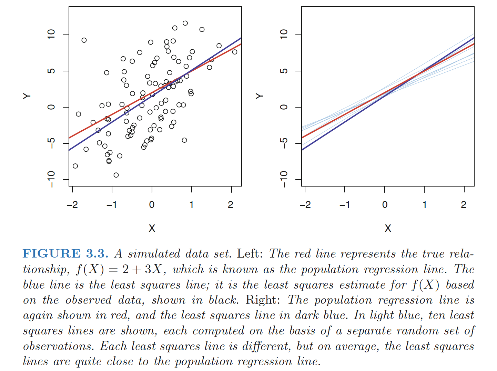
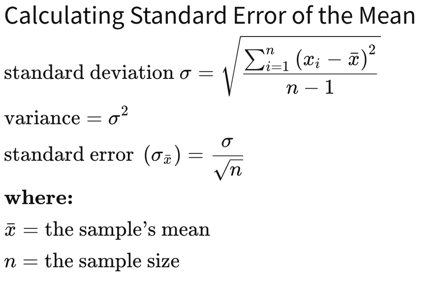
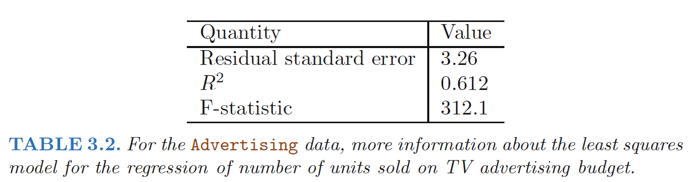
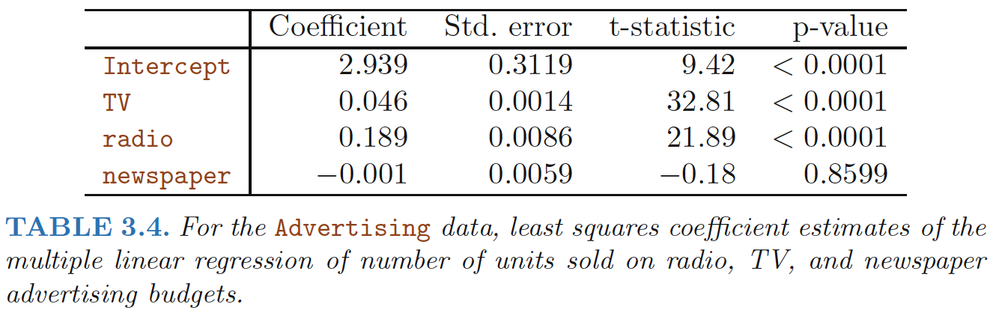
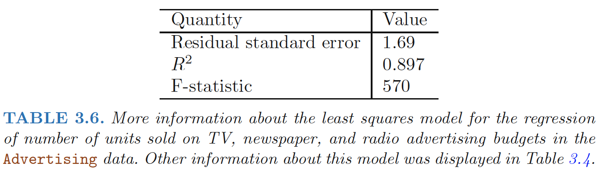

# Simple Linear Regression Models

## Linear Regression Model

- Form of the linear regression model: *$y=\beta_{0}+\beta_{1}X+\epsilon$*.

- Training data: ($x_1$,$y_1$) ... ($x_N$,$y_N$). Each $x_{i} =(x_{i1},x_{i2},...,x_{ip})^{T}$ is a vector of feature measurements for the $i$-th case. 

- Goal: estimate the parameters $β$

- Estimation method: **Least Squares**, we pick the coefficients $β =(β_0,β_1,...,β_p)^{T}$ to minimize the **residual sum of squares**

**Assumptions:**

- Observations $y_i$ are uncorrelated and have constant variance $\sigma^2$;
- $x_i$ are fixed (non random)
- The regression function $E(Y |X)$ is linear, or the linear model is a reasonable approximation.

<!--more-->

## Residual Sum of Squares

**Residual**: $e_i = y_i−\hat{y_i}$ represents the ith residual—this is the difference between the i-th observed response value and the i-th response value that is predicted by our linear model. 
$$
\begin{align}
\text{Residual sum of squares(RSS) } \quad R(\beta)&=e_1^2+e_2^2+e_3^2+...e_n^2 \\
&=\sum_{i=1}^{N}(y_{i}-f(x_{i}))^2 \\
&=\sum_{i=1}^{N}(y_{i}-\beta_{0}-\sum_{j=1}^{p}X_{ij}\beta_{j})^2
\end{align}
$$


### Solution
Denote by $X$ the $N × (p + 1) $ matrix with each row an input vector ( $1$ in the first position), and similarly let $y$ be the $N$-vector of outputs in the training set.

$$
\begin{align} \min RSS(\beta)= (y-\mathbf{X}\beta)^T(y-\mathbf{X}\beta) \end{align}
$$
A quadratic function in the $p + 1$ parameters

Taking derivatives:

$$
\begin{align} \frac{\partial RSS}{\partial \beta}=-2\mathbf{X}^T(y-\mathbf{X}\beta) \end{align}
$$

$$
\begin{align} \frac{\partial^2 RSS}{\partial \beta \partial \beta^T}=2\mathbf{X}^T\mathbf{X}  \end{align}
$$

Assuming (for the moment) that $\mathbf{X}$ has **full column rank** (i.e. each of the columns of the matrix are *linearly independent*), hence $\mathbf{X}^T\mathbf{X}$ is **positive definite** (every eigenvalue is positive), we set the first derivative to zero: $\mathbf{X}^T(y-\mathbf{X}\beta)=0$

*Least squares coefficient estimates for simple linear regression*:
$$
\begin{align}
\Rightarrow \hat{\beta_1}&=(\mathbf{X}^T\mathbf{X})^{-1}\mathbf{X}^Ty \\
&=\frac{\sum_{i=1}^n(x_i-\bar{x})(y_i-\bar{y})}{\sum_{i=1}^n(x_i-\bar{x})^2} \\
\hat{\beta_0}&=\bar{y}-\hat{\beta_1}\bar{x} 
\end{align}
$$
where $\bar{y}=\sum_{i=1}^ny_i/n$, $\bar{x}=\sum_{i=1}^nx_i/n$ are the **sample means**.


Fitted values at the training inputs: $\hat{y}=\mathbf{X}(\mathbf{X}^T\mathbf{X})^{-1}\mathbf{X}^Ty$

Hat matrix: $H=\mathbf{X}(\mathbf{X}^T\mathbf{X})^{-1}\mathbf{X}^T$


## Assessing the Accuracy of the Coefficient Estimates 

Assume that the true relationship between $X$ and $Y$ takes the form $Y = f(X) + \epsilon$ for some unknown function $f$, where $\epsilon$ is  a mean-zero random error term.

**Least squares line**:
$$
\begin{align}
\hat{y_i} = \hat{β_0} + \hat{β_1}x_i
\end{align}
$$
**Population regression line**:
$$
\begin{align}
Y=\beta_0+\beta_1X+\epsilon
\end{align}
$$
The **error term** is a catch-all for what we miss with this simple model: the true relationship is probably not linear, there may be other variables that cause variation in $Y$ , and there may be measurement error. We typically assume that the error term is **independent** of $X$.




### Population V.S. Sample

The true relationship is generally not known for real data, but the least squares line can always be computed using the coefficient estimates.

**Why there are two different lines describe the relationship between the predictor and the response?**

- The concept of these two lines is a natural extension of the standard statistical approach of using information from a sample to estimate characteristics of a large population.
- The **sample mean** $\bar{x}=\sum_{i=1}^nx_i/n$ and the **population mean** $\mu$ are different, but in general the sample
  mean $\bar{x}$ will provide a good estimate of the population mean $\mu$.

**Unbiased**

- If we use the sample mean $\bar{x}$ to estimate μ, this estimate is **unbiased**, in the sense that on average, we expect $\bar{x}$ to equal $μ$.
- An unbiased estimator does not systematically over- or under-estimate the true parameter.


### Standard Error

**How accurate is the sample mean $\hat{\mu}$ as an estimate of μ?**

- **Standard error of $\hat{\mu}$**: standard deviation of the means; average amount that this estimate $\hat{\mu}$ differs from the actual value of $μ$.
  $$
  \begin{align}
  Var(\hat{\mu})=SE(\hat{\mu})^2=\frac{s^2}{n} \\
  s=\sqrt{\frac{\sum_{i}\epsilon^2}{n-1}}
  \end{align}
  $$
  where $σ$ is the standard deviation of each of the realizations $y_i$ of $Y$ provided that the $n$ observations are **uncorrelated**.

**Standard Deviation V.S. Standard Error**

- The **standard deviation (SD)** measures the amount of variability, or dispersion, for a subject set of data from the mean
- The **standard error** of the mean (SEM) measures how far the sample mean of the data is likely to be from the **true population mean**. 




### Statistical Properties of $\hat{\beta}_0$ and $\hat{\beta}_1$ 

**How close $\hat{\beta}_0$ and $\hat{\beta}_1$ are to the true values $\beta_0$ and $\beta_1$?**
$$
\begin{align}
Var(\hat{\beta_0})^2&=\sigma^2\left[\frac{1}{n}+\frac{\bar{x}^2}{\sum_{i=1}^n(x_i-\bar{x})^2}  \right]  \\
Var(\hat{\beta_1})^2&=\frac{\sigma^2}{\sum_{i=1}^n(x_i-\bar{x})^2} 
\end{align}
$$


​		where $\sigma^2 = Var(\epsilon)$

- Proof:
  $$
  \begin{align}
  \hat{\beta_1}&=\frac{\sum_{i=1}^n(x_i-\bar{x})(y_i-\bar{y})}{\sum_{i=1}^n(x_i-\bar{x})^2} = \frac{\sum_{i=1}^n(x_i-\bar{x})y_i}{\sum_{i=1}^n(x_i-\bar{x})^2} \\
  Var(\hat{\beta_1})&=Var(\frac{\sum_{i=1}^n(x_i-\bar{x})y_i}{\sum_{i=1}^n(x_i-\bar{x})^2} ) \\
  &=Var(\frac{\sum_{i=1}^n(x_i-\bar{x})(\beta_0+\beta_1x_i+\epsilon_i)}{\sum_{i=1}^n(x_i-\bar{x})^2}) \\
  &=Var(\frac{\sum_{i=1}^n(x_i-\bar{x})\epsilon_i}{\sum_{i=1}^n(x_i-\bar{x})^2}) \quad\text{ note only $\epsilon$ is a r.v.} \\
  &=\frac{\sum_{i=1}^n(x_i-\bar{x})^2Var(\epsilon_i)}{(\sum_{i=1}^n(x_i-\bar{x})^2)^2}  \quad \text{independence of $\epsilon_i$ and, $Var(𝑘𝑋)=𝑘^2Var(𝑋)$} \\
  &=\frac{\sigma^2}{\sum_{i=1}^n(x_i-\bar{x})^2}
  \end{align}
  $$

- For these formulas to be strictly valid, we need to assume that the errors $\epsilon_i$ for each observation are uncorrelated with common variance $σ^2$. 

### **Estimate $\sigma^2$**

**Residual standard error(RSE)**: $\sigma$ is not known, but can be estimated from the data. This estimate
is known as the **residual standard error** (an unbiased estimate of $σ$)
$$
\begin{align}
RSE=\hat{\sigma}=\sqrt{RSS/(n-2)}=\sqrt{\frac{1}{N-2}\sum^{N}_{i=1}(y_i-\hat{y_i})^2 }
\end{align}
$$

- The divisor *n* − 2 is used rather than *n* because two parameters have been estimated from the data, giving *n* − 2 degrees of freedom.


### Sampling Properties of $\beta$

The <u>variance–covariance</u> matrix of the least squares parameter estimates: 
$$
\begin{align} Var(\hat{\beta})=(\mathbf{X}^T\mathbf{X})^{-1}\sigma^2 \end{align}
$$
**Unbiased estimate of $\sigma^2$:** 
$$
\begin{align} \hat{\sigma}^2=\frac{1}{N-p-1}\sum^{N}_{i=1}(y_i-\hat{y_i})^2 \end{align}
$$
If the errors, $\epsilon_i$ , are independent normal random variables, then the estimated slope and intercept, being linear combinations of independent normally distributed random variables, are normally distributed as well. 

More generally, if $\epsilon_i$ are independent and the $x_i$ satisfy certain assumptions, a version of the **central limit theorem** implies that, for large *n*, the estimated slope and intercept are approximately normally distributed. 

Thus, $\beta$ follows **<u>multivariate normal distribution</u>** with mean vector and variance–covariance matrix:
$$
\begin{align}\hat{\beta} \sim N(\beta,(\mathbf{X}^T\mathbf{X})^{-1}\sigma^2 ) \end{align}
$$
Also, a chi-squared distribution with $N −p−1$ degrees of freedom:
$$
\begin{align} (N-p-1)\hat{\sigma}^2 \sim \sigma^2 \chi_{N-p-1}^{2} \end{align}
$$
($\hat{\beta}$ and $\hat{\sigma^2}$ are indep.)

We use these distributional properties to form tests of hypothesis and confidence intervals for the parameters $\beta_j$:

**Confidence Intervals**

- **A 95% confidence confidence interval**: is defined as a range of values such that with 95% interval probability, the range will contain the true unknown value of the parameter.

- For linear regression, the 95% confidence interval for $β_1$ approximately takes the form
  $$
  \begin{align}
  &\hat{\beta_1} \pm 1.96 \cdot SE(\hat{\beta_1})     \\
  &SE(\hat{\beta_1}) =\frac{\sigma^2}{\sum_{i=1}^n(x_i-\bar{x})^2} 
  \end{align}
  $$
  (which relies on the assumption that the errors are Gaussian. Also, the factor of 2 in front of the $SE(\hat{\beta_1})$ term will vary slightly depending on the number of observations n in the linear regression. To be precise, rather than the number 2, it should contain the 97.5% quantile of a t-distribution with n−2 degrees of freedom.)


### Hypothesis Tests

The most common hypothesis test involves testing the **null test hypothesis** of

```
H_0: No relationship between X and Y or β1=0
```

versus the **alternative hypothesis**

```
H_a : There is some relationship between X and Y or β1≠0
```

To test the null hypothesis, we need to determine whether $\hat{\beta_1}$, our estimate for $\beta_1$, is sufficiently far from zero that we can be confident that $\beta_1$ is non-zero $\Rightarrow$ it depends on $SE( \hat{\beta_1}$)

- If $SE( \hat{\beta_1}$) is small, then even relatively small values of $\hat{\beta_1}$ may provide strong evidence that $\beta_1 \neq 0$, and hence that there is a relationship between X and Y

#### **t-statistic**

To test the hypothesis that a particular coefficient $\beta_j= 0$, we form the standardized coefficient or Z-score
$$
\begin{align}
t=\frac{\hat{\beta_1}-0}{SE(\hat{\beta_1})}  \\ or \quad 
z_j=\frac{\hat{\beta_j}-0}{\hat{\sigma}\sqrt{\upsilon_j}}
\end{align}
$$
where $\upsilon_j$ is the j-th diagonal element of $(\mathbf{X}^T\mathbf{X})^{-1}$

which measures the number of standard deviations that $\hat{\beta_1}$ is away from 0.If there really is no relationship between $X$ and $Y$ , then we expect it will have a $t$-distribution with $n−2$ degrees of freedom.

Under the null hypothesis that $\beta_j= 0$, $z_j$ is distributed as $t_{N-p-1}$, and hence **a large (absolute) value** of $z_j$ will lead to *rejection of this null hypothesis*. If $\hat{\sigma}$ is replaced by a known value $σ$, then $z_j$ would have a standard normal distribution.

#### **p-value**

- The probability of observing any value $≥ t$ or $≤ -t$, assuming $β_1 = 0$.


(Here $|t|=2.17, p-value=0.015$. The area in red is 0.015 + 0.015 = 0.030, 3%. If we had chosen a significance level of 5%, this would mean that we had achieved *statistical significance*. We would *reject the null hypothesis* in favor of the alternative hypothesis.)

- **Interpretation**:a small p-value indicates
  - It is unlikely to observe such a substantial association between the predictor and the response due to LUCK, in the absence of any real association between the predictor and the response.
  - We reject the null hypothesis—that is, we declare a relationship to exist between X and Y

#### **F-statistic**:

To test if a **categorical variable** with $k$ levels can be *excluded* from a model, we need to test whether the coefficients of the **dummy variables** used to represent the levels can all be set to zero. Here we use the $F$ statistic：

$$
\begin{align} F=\frac{(RSS_0-RSS_1)/(p_1-p_0)}{RSS_1/(N-p_1-1)} \end{align}
$$


- $RSS_1$ is the residual sum-of-squares for the least squares fit of the *bigger model* with $p_1+1$ parameters;
- $RSS_0$ the same for the nested smaller model with $p_0 +1$ parameters, having $p_1 −p_0$ parameters constrained to be zero.

The $F$ statistic measures the change in residual sum-of-squares *per additional parameter* in the bigger model, and it is normalized by an estimate of $\sigma^2$.

Under the Gaussian assumptions, and the null hypothesis that the **smaller model is correct**, the $F$ statistic will have a $F_{p_1-p_0,N-p_1-1}$ distribution. 


## The Gauss–Markov Theorem

We focus on estimation of any linear combination of the parameters $\theta=\alpha^T\beta$, for example, predictions $f(x_0)=x^T_0\beta$ are of this form.The least squares estimate of $\alpha^T\beta$ is:
$$
\begin{equation}
\hat{\theta}=\alpha^T\hat{\beta}=\alpha^T(\mathbf{X}^T\mathbf{X})^{-1}\mathbf{X}^T\mathbf{y}
\end{equation}
$$
Considering $\mathbf{X}$ to be fixed, this is a linear function $\mathbf{c}^T_0\mathbf{y}$ of the response vector $\mathbf{y}$.If we assume that the linear model is correct, $\alpha^T\hat{\beta}$ is unbiased.

The Gauss–Markov theorem states that if we have any other linear estimator $\tilde{\theta}=\mathbf{c}^T\mathbf{y}$ that is unbiased for $\alpha^T\beta$, that is, $E(\mathbf{c}^T\mathbf{y})= \alpha^T\beta$, then:
$$
\begin{equation}
Var(\alpha^T\hat{\beta})\leq Var(\mathbf{c}^T\mathbf{y})
\end{equation}
$$


## Assessing the Accuracy of the Model

The quality of a linear regression fit is typically assessed using two related quantities: **the residual standard error (RSE)** and the **$R^2$** statistic.


### Residual Standard Error

The $RSE$ is <u>an estimate of the standard deviation of $\epsilon$: t</u>he average amount that the response
will deviate from the true regression line
$$
\begin{align}
RSS&=\sum_{i=1}^n(y_i-\hat{y})^2  \\
RSE&=\sqrt{\frac{1}{n-2}RSS}=\sqrt{\frac{1}{n-2}\sum_{i=1}^n(y_i-\hat{y})^2}
\end{align}
$$


In the case of the advertising data, we see from the linear regression output in Table 3.2 that the RSE is 3.26. In other words, actual sales in each market deviate from the true regression line by approximately 3,260 units, on average. 

The mean value of sales over all markets is approximately 14,000 units, and so the percentage error is
3,260/14,000 = 23%.

<u>The RSE is considered a measure of the **lack of fit** of the model $Y = β_0 + β_1X + \epsilon$ to the data</u>.


### $R^2$ Statistic

The $RSE$ is measured in the units of $Y$ , it is not always clear what constitutes a good $RSE$. 

The $R^2$ statistic takes the form of a **proportion**—<u>the proportion of variance explained</u>—and so it always takes on a value **between 0 and 1**, and is independent of the scale of $Y$ .
$$
\begin{align}
R^2 = (TSS − RSS)/TSS= 1− RSS/TSS =  1-\frac{\sum(y_i-\hat{y})^2}{\sum(y_i-\bar{y})^2}
\end{align}
$$
**TSS(total sum of squares)**: $\sum(y_i-\bar{y})^2$ - the amount of variability inherent in the response before the
regression is performed

**RSS**: $\sum_{i=1}^n(y_i-\hat{y})^2$ - the amount of variability that is left unexplained after performing the regression

**(TSS−RSS)**: measures the amount of variability in the response that is explained (or removed) by performing the regression, and **$R^2$ measures the proportion of variability in $Y$ that can be explained using $X$.**

**Interpretation**：

- <u>close to 1</u> : a large proportion of the variability in the response has been explained by the regression. 
- <u>close to 0</u> : the regression did not explain much of the variability in the response
  - The linear model is wrong
  - The inherent error $σ^2$ is high, or both.


### Squared Correlation V.S. R2 Statistic

**Correlation**:
$$
\begin{align}
Corr(X,Y)=\frac{\sum_{i=1}^n(x_i-\bar{x})(y_i-\bar{y})}{\sqrt{\sum_{i=1}^n(x_i-\bar{x})^2}\sqrt{\sum_{i=1}^n(y_i-\bar{y})^2}}=\hat{\beta}_1\frac{\sqrt{\sum_{i=1}^n(x_i-\bar{x})^2}}{\sqrt{\sum_{i=1}^n(y_i-\bar{y})^2}}
\end{align}
$$
- the correlation is zero if and only if the slope is zero.

- also a measure of the linear relationship between X and Y.

> In the simple linear regression setting, $R^2 = [Cor]^2$. In other words, the squared correlation and the R2 statistic are identical


## p-Value v.s. $R^2$

Referring answer fromn [Faye Anderson](https://www.researchgate.net/profile/Faye_Anderson3):

There is no established association/relationship between p-value and R-square. This all depends on the data (i.e.; contextual).

R-square value tells you **how much variation is explained by your model**. So $R^2=0.1$  means that your model explains 10% of variation within the data. The greater R-square the better the model. 

Whereas p-value tells you about the F-statistic hypothesis testing of the "fit of the intercept-only model and your model are equal". So if the p-value is less than the significance level (usually 0.05) then your model fits the data well.

<u>Thus you have four scenarios:</u>

**1) low R-square and low p-value (p-value <= 0.05) :** means that your model doesn't explain much of variation of the data but it is significant (better than not having a model)

**2) low R-square and high p-value (p-value > 0.05) :** means that your model doesn't explain much of variation of the data and it is not significant (worst scenario)

**3) high R-square and low p-value :** means your model explains a lot of variation within the data and is significant (best scenario)

**4) high R-square and high p-value :** means that your model explains a lot of variation within the data but is not significant (model is worthless)


## Variance & Bias

Consider the **mean squared error** of an estimator $\tilde{\theta}$ in estimating $\theta$:

$$
\begin{align}
MSE(\tilde{\theta})&= E(\tilde{\theta}-\theta)^2 \\
&= E(\tilde{\theta^2}+\theta^2-2\theta\tilde{\theta}) \\
&= E(\tilde{\theta^2})-E^2(\tilde{\theta})+E^2(\tilde{\theta})+E(\theta^2-2\theta\tilde{\theta})\\
&= Var(\tilde{\theta})+[E(\tilde{\theta})-\theta]^2
\end{align}
$$
The first term is the **variance**, while the second term is the **squared bias**.

The **Gauss-Markov theorem** implies that the *least squares estimator* has the smallest *mean squared error* of all linear estimators with *no bias*. However, there may well exist a biased estimator with smaller mean squared error. <font color='red'>Such an estimator would trade a little bias for a larger reduction in variance.</font>

From a more pragmatic point of view, most models are distortions of the truth, and hence are biased; picking the right model amounts to creating the right balance between bias and variance.

**Mean squared error** is intimately related to *prediction accuracy*. Consider the prediction of the new response at input $x_0$,
$$
\begin{equation}
y_0=f(x_0)+\epsilon_0
\end{equation}
$$


### Prediction error & MSE
The **expected prediction error** of an estimate $\tilde{f}(x_0)=x_0^T\tilde{\beta}$:

$$
\begin{align}
E(y_0-\tilde{f}(x_0))^2 &=E(f(x_0)+\epsilon_0-x_0^T\tilde{\beta})^2 \\
&=E(\epsilon_0^2)+E(f(x_0)-x_0^T\tilde{\beta})^2-2E(\epsilon_0(f(x_0)-x_0^T\tilde{\beta})) \\
&=\sigma^2+E(f(x_0)-x_0^T\tilde{\beta})^2 \\
&=\sigma^2+MSE(\tilde{f}(x_0))
\end{align}
$$
Therefore, expected prediction error and mean squared error differ only by the constant $\sigma^2$, representing the *variance of the new observation $y_0$.*


# Multiple Linear Regression

Multiple linear regression model takes the form:
$$
\begin{align}
Y=\beta_0+\beta_1X_1+,,,+\beta_pX_p+\epsilon
\end{align}
$$

## Estimating the Regression Coefficients 

We choose $β_0, β_1, . . . , β_p$ to minimize the sum of squared residuals
$$
\begin{align}
RSS&=\sum_{i=1}^n(y_i-\hat{y}_i)^2 \\
&=\sum_{i=1}^n(y_i-\hat{\beta_0}-\hat{\beta_1}x_{i1}-,,,-\hat{\beta_p}x_{ip})^2
\end{align}
$$


**Does it make sense for the multiple regression to suggest no relationship between *sales* and *newspaper* while the simple linear regression implies the opposite?**

- Notice that the correlation between radio and newspaper is 0.35.
- In markets where we spend more on radio our sales will tend to be higher, and as our correlation matrix shows, we also tend to spend more on newspaper advertising in those same markets. 
- Hence, in a simple linear regression which only examines sales versus newspaper, we will observe that higher values of newspaper tend to be associated with higher values of sales, even though newspaper advertising does not actually affect sales. 


## Some Important Questions

### 1. Is There a Relationship Between the Response and Predictors?

#### **Hypothesis Test**

We use a hypothesis test to answer this question. 

We test the **null hypothesis**

```
H_0 : β1 = β2 = · · · = βp = 0
```

versus the **alternative**

```
H_a : at least one βj is non-zero
```

This hypothesis test is performed by computing the **F-statistic**,
$$
\begin{align}
F=\frac{(TSS-RSS)/p}{RSS/(n-p-1)}
\end{align}
$$
where $TSS =\sum(y_i − \bar{y})^2$ and $RSS =\sum(y_i−\hat{y}_i)^2$. 

If the linear model assumptions are correct, one can show that
$$
\begin{align}
E[RSS/(n-p-1)]=\sigma^2
\end{align}
$$
and that, provided $H_0$ is true,
$$
\begin{align}
E[(TSS-RSS)/p]=\sigma^2
\end{align}
$$

- When there is no relationship between the response and predictors, one would expect the **F-statistic to take on a value close to 1.** 
- On the other hand, if $H_a$ is true, then $E[(TSS-RSS)/p]>\sigma^2$, so we expect **$F$ to be**
  **greater than 1.**




### 2. How large does the F-statistic need to be before we can reject $H_0$ and conclude that there is a relationship?

- When $n$ is large, an *F-statistic* that is just a little larger than 1 might still provide evidence against $H_0$. 
- In contrast, a larger F-statistic is needed to reject $H_0$ if $n$ is small.
- For the advertising data, the **p-value** associated with the F-statistic in Table 3.6 is essentially zero, so we have extremely strong evidence that at least one of the media is associated with increased sales.

**To test that a particular subset of $q$ of the coefficients are zero**

This corresponds to a null hypothesis

$$
H_0 : β_{p-q+1} = β-{p-q+2} = · · · = β_p = 0
$$
In this case we fit a second model that uses all the variables **except those last $q$**. Suppose that the residual sum of squares for that model is $RSS_0$. Then the appropriate F-statistic is
$$
\begin{align}
F=\frac{(RSS_0-RSS)/q}{RSS/(n-p-1)}
\end{align}
$$

#### **F-statistics v.s. t-statistics**

- **Equivalency**: In Table 3.4, for each individual predictor a *t-statistic* and a *p-value* were reported. These provide information about **whether each individual predictor is related to the response**, after adjusting for the other predictors. It turns out that each of these are exactly equivalent to the *F-test* that omits that single variable from the model, leaving all the others
  in—i.e. q=1 in the model. So it reports the **partial effect** of adding that variable to the model.
  
  > The square of each *t-statistic* is the corresponding *F-statistic*.
  
- **$p$ is large**: If any one of the *p-values* for the individual variables is very small, then ***at least one of the
  predictors is related to the response***. However, this logic is flawed, especially when the number of predictors $p$ is large.

  - If we use the individual *t-statistics* and associated *p-values* to decide whether there is any association between the variables and the response, high chance we will incorrectly conclude there is a relationship. 
  - However, the *F-statistic* does not suffer from this problem because **it adjusts for the number of predictors**.
- **$p > n$**: more coefficients $β_j$ to estimate than observations from which to estimate them. 

  - cannot even fit the multiple linear regression model using least squares,

### 3. Do all the predictors help to explain Y , or is only a subset of the predictors useful? 

#### **Variable Selection**

- Various statistics can be used to *judge the quality of a model:*
  - **Mallow’s Cp, Akaike informa-Mallow’s Cp tion criterion (AIC)**
  - **Bayesian information criterion (BIC)**
  - **adjusted R2**
- There are three classical approaches to *select models:*
  - **Forward selection**
  - **Backward selection**
  - **Mixed selection**

### 4. How well does the model fit the data?

Two of the most common numerical measures of model fit are the **RSE** and **$R^2$**

#### $R^2$ Statistics

An $R^2$ value close to $1$ indicates that the model explains a large portion of the variance in the response variable.
$$
\begin{align}
R^2 = (TSS − RSS)/TSS= 1− RSS/TSS
\end{align}
$$
Recall that in simple regression,  $R^2$ is the *square of the correlation* of the response and the variable. In multiple linear regression, it turns out that it equals $Cor(Y, \hat{Y} )^2$, the square of the correlation between the response and the fitted linear model; in fact one property of the fitted linear model is that it maximizes this correlation among all possible linear models.

**$R^2$ will always increase when more variables are added to the model, even if those variables are only weakly associated with the response.**

- This is due to the fact that adding another variable to the least squares equations must allow us to fit the training data (though not necessarily the testing data) more accurately.
- The fact that adding *newspaper* advertising to the model containing only TV and radio
  advertising leads to just a tiny increase in $R_2$ provides additional evidence that newspaper can be dropped from the model.

#### RSE

**RSE** is defined as
$$
\begin{align}
RSE=\sqrt{\frac{RSS}{n-p-1}}
\end{align}
$$
Models with more variables can have higher RSE if the decrease in RSS is small relative to the increase in $p$.

#### Graphical summaries


It suggests a **synergy** or **interaction** effect between the advertising media, whereby combining the media together results in a bigger boost to sales than using any single medium

### 5. Given a set of predictor values, what response value should we predict, and how accurate is our prediction? 

#### **Uncertainty associated with prediction**

1. The coefficient estimates $\hat{\beta_0},\hat{\beta_1},...,\hat{\beta_p}$ are estimates for $β_0, β_1, . . . , β_p$. That is, the **least squares plane**
   $$
   \begin{align}
   \hat{Y}=\hat{\beta_0}+\hat{\beta_1}X_1+,...+\hat{\beta_p}X_p
   \end{align}
   $$
   is only an estimate for the **true population regression plane**
   $$
   \begin{align}
   f(X)=\beta_0+\beta_1X_1+,...+\beta_pX_p
   \end{align}
   $$

- The inaccuracy in the coefficient estimates is related to the **reducible error**. 
- We can compute a **confidence interval** in order to determine how close $\hat{Y}$ will be to $f(X)$.

2. In practice, assuming a linear model for $f(X)$ is almost always an approximation of reality, so there is an additional source of potentially **reducible error** which we call **model bias**.
3. Even if we knew $f(X)$—true values for $β_0, β_1, . . . , β_p$—the response value cannot be predicted perfectly
   because of the random error $\epsilon$ --**irreducible error**. 

- How much will Y vary from $\hat{Y}$? -- **prediction intervals** 

#### **Prediction intervals** 

**Prediction intervals** are always wider than **confidence intervals**

- Because they incorporate both *the error in the estimate for f(X) (the reducible error) and the uncertainty as to how much an individual point will differ from the population regression plane (the irreducible error).*

E.g. 

- **confidence interval** : quantify the uncertainty surrounding the average sales over a large number of cities.
- **prediction interval** : quantify the uncertainty surrounding sales for a particular city.


## Multiple Regression from Simple Univariate Regression

Gram-Schmidt正交化

### Simple Univariate Regression
Suppose first that we have a univariate model with no intercept:
$$
\begin{align}
\mathbf{Y}=\mathbf{X}\beta+\epsilon
\end{align}
$$
The least squares estimate and residuals are:
$$
\begin{align}
\hat{\beta}&=\frac{\sum_1^Nx_iy_i}{\sum_1^Nx_i^2} \\
r_i&=y_i-x_i\hat{\beta}
\end{align}
$$
The least squares estimate and residuals are:
$$
\begin{align}
\hat{\beta}&=\frac{\sum_1^Nx_iy_i}{\sum_1^Nx_i^2} \\
r_i&=y_i-x_i\hat{\beta}
\end{align}
$$
Let $\mathbf{y}=(y_1,...,y_N)^T$,$\mathbf{x}=(x_1,...,x_N)^T$

Define the **inner product** between $\mathbf{x}$ and  $\mathbf{y}$:
$$
\begin{align}
<\mathbf{x},\mathbf{y}>=\sum_1^Nx_iy_i=\mathbf{x}^T\mathbf{y}
\end{align}
$$
Then,
$$
\begin{align}
\hat{\beta}&=\frac{<\mathbf{x},\mathbf{y}>}{<\mathbf{x},\mathbf{x}>} \\
\mathbf{r}&=\mathbf{y}-\mathbf{x}\hat{\beta}
\end{align}
$$
Suppose the inputs $x_1, x_2,..., x_p$ (the columns of the data matrix $\mathbf{X}$) are orthogonal; that is $<\mathbf{x_k},\mathbf{x_j}>=0$. Then the multiple least squares estimates $\hat{\beta_j}$ are equal to $\frac{<\mathbf{x_j},\mathbf{y}>}{<\mathbf{x_j},\mathbf{x_j}>}$—the univariate estimates. In other words, <font color='red'>when the inputs are orthogonal, they have no effect on each other’s
parameter estimates in the model.</font>

### Orthogonalization
$$
\begin{align}
\hat{\beta}_1&=\frac{<\mathbf{x}-\bar{x}\mathbf{1},\mathbf{y}>}{<\mathbf{x}-\bar{x}\mathbf{1},\mathbf{x}-\bar{x}\mathbf{1}>} \\
\end{align}
$$


-  $\bar{x}=\sum_ix_i/N$;
- $\mathbf{1}$, the vector of N ones;

**Steps:**
1. regress $\mathbf{x}$ on $\mathbf{1}$ to produce the residual $\mathbf{z}=\mathbf{x}-\bar{x}\mathbf{1}$;
2. regress $\mathbf{y}$ on the residual $\mathbf{z}$ to give the coefficient $\hat{\beta}_1$

Regress $\mathbf{a}$ on $\mathbf{b}$ ($\mathbf{b}$ is adjusted for $\mathbf{a}$),(or $\mathbf{b}$ is **“orthogonalized”** with respect to  $\mathbf{a}$); a simple univariate regression of $\mathbf{b}$ on a with no intercept, producing coefficient $\hat{\lambda}=\frac{<\mathbf{a},\mathbf{b}>}{<\mathbf{a},\mathbf{a}>}$ and residual vector $ \mathbf{b}-\hat{\lambda} \mathbf{a}$.

The orthogonalization does not change the subspace spanned by $x_1$ and $x_2$, it simply produces an **orthogonal basis** for representing it.


### Gram–Schmidt procedure for multiple regression

**ALGORITHM 3.1 Regression by Successive Orthogonalization**

1. Initialize $\mathbf{z_0}=\mathbf{x_0}=\mathbf{1}$.
2. For j=1,2,...,1,,...,p,<br>
  Regress $\mathbf{x_j}$ on $\mathbf{z_0},\mathbf{z_1},...,\mathbf{z_{j-1}}$ to produce coefficients $\hat{\lambda}_{l,j}=\frac{<\mathbf{z_l},\mathbf{x_j}>}{<\mathbf{z_l},\mathbf{z_l}>}$, l=0,1,...,j-1, and residual vector $\mathbf{z_j}=\mathbf{x_j}-\sum_{k=0}^{j-1}\hat{\lambda_{kj}}\mathbf{z_k}$
3. Regress $\mathbf{y}$ on the residual $\mathbf{z_p}$ to give the estimate $\hat{\beta_p}=\frac{<\mathbf{z_p},\mathbf{y}>}{<\mathbf{z_p},\mathbf{z_p}>}$.

**Note:**

- Each of the $\mathbf{x}_j$ is a linear combination of the $\mathbf{z}_k$, $k ≤ j$.
- Since the $\mathbf{z}_j$ are all orthogonal, they form a basis for the column space of $\mathbf{X}$, and hence the least squares projection
onto this subspace is $\mathbf{\hat{y}}$.
- By rearranging the $x_j$ , any one of them could be in the last position, and a similar results holds.
- The multiple regression coefficient $\mathbf{x}_j$ represents the additional contribution of $\mathbf{x}_j$ on $\mathbf{y}$, after $\mathbf{x}_j$ has been adjusted for $x_0, x_1,..., x_{j−1},x_{j+1},..., x_p$.

### Precision of Coefficient Estimation

If $\mathbf{x}_p$ is highly correlated with some of the other $\mathbf{x}_k$’s, the residual vector $\mathbf{z}_p$ will be close to zero, and the coefficient $\mathbf{x}_j$ will be very unstable.

From $\hat{\beta_p}=\frac{<\mathbf{z_p},\mathbf{y}>}{<\mathbf{z_p},\mathbf{z_p}>}$, we also obtain an alternate formula for the variance estimates:

$$
\begin{align}Var(\hat{\beta}_p)=\frac{\sigma^2}{<\mathbf{z_p},\mathbf{z_p}>}=\frac{\sigma^2}{||\mathbf{z_p}||^2} \end{align}
$$


The precision with which we can estimate $\hat{\beta_p}$ depends on the length of the residual vector $\mathbf{z_p}$; this represents how much of $\mathbf{x_p}$ is unexplained by the other $\mathbf{x_k}$’s

### QR decomposition
We can represent step 2 of Algorithm 3.1 in matrix form:

$$
\begin{align}
\mathbf{X}=\mathbf{Z}\mathbf{Γ}
\end{align}
$$


- $\mathbf{Z}$ has as columns the $\mathbf{z_j}$ (in order)
- $\mathbf{Γ}$ is the upper triangular matrix with entries $\hat{\lambda}_{kj}$

Introducing the diagonal matrix D with jth diagonal entry $D_{jj} = ||\mathbf{z_j}||$, we get 

**QR decomposition of X**:

$$
\begin{align}
\mathbf{X}=\mathbf{Z}\mathbf{D}^{-1}\mathbf{D}\mathbf{Γ}=\mathbf{Q}\mathbf{R}
\end{align}
$$


- $\mathbf{Q}$ is an $N ×(p+1)$ orthogonal matrix, $Q^TQ=I$;
- $\mathbf{R}$ is a $(p +1) × (p + 1) $Vupper triangular matrix.

**Least squares solution:**
$$
\begin{align}
\hat{\beta}&=R^{-1}Q^T\mathbf{y} \\
\mathbf{\hat{y}}&=QQ^T\mathbf{y}
\end{align}
$$


## 3.2.4 Multiple Outputs

Suppose we have multiple outputs Y1,Y2,...,YK that we wish to predict from our inputs X0,X1,X2,...,Xp. We assume a linear model for each
output:

$$
\begin{align}
Y_k&=\beta_{0k}+\sum_{j=1}^pX_j\beta_{jk}+\epsilon_k \\
&=f_k(X)+\epsilon_k
\end{align}
$$


With N training cases we can write the model in matrix notation:

- $$
  \begin{align}
  Y=XB+E
  \end{align}
  $$
  
- Y: N×K response matrix

- X: N×(p+1) input matrix

- B: (p+1)× K matrix of parameters

- E: N×K matrix of errors

A straightforward generalization of the univariate loss function:

$$
\begin{align}
RSS(B)&=\sum_{k=1}^K\sum_{i=1}^N(y_{ik}-f_k(x_i))^2 \\
&=tr[(Y-XB)^T(Y-XB)]
\end{align}
$$
The least squares estimates have exactly the same form as before:
$$
\begin{align}
\hat{B}=(X^TX)^{-1}X^Ty
\end{align}
$$
If the errors $\epsilon =(\epsilon_1,...,\epsilon_K)$ in are correlated, suppose $Cov(\epsilon)= Σ$, then the multivariate weighted criterion:
$$
\begin{align}
RSS(B;Σ)&=\sum_{i=1}^N(y_{ik}-f_k(x_i))^TΣ^{-1}(y_{ik}-f_k(x_i)) 
\end{align}
$$


# Comparison of Linear Regression with K-Nearest Neighbors


## Parametric v.s. Non-parametric

**Linear regression** is an example of a **parametric** approach because it assumes a linear functional form for $f(X)$. 

**Parametric methods** 

- **Advantages**:
  - *Easy to fit*, because one need estimate only a small number of coefficients. 
  - *Simple interpretations*, and tests of statistical significance can be easily performed
- **Disadvantage**: 
  - *Strong assumptions about the form of $f(X)$*. If the specified functional form is far from the truth, and
    prediction accuracy is our goal, then the parametric method will perform poorly.


**Non-parametric methods** 

- Do not explicitly assume a parametric form for $f(X)$, and thereby provide an alternative and more flexible
  approach for performing regression.
- **K-nearest neighbors** regression (KNN regression)


## KNN Regression

Given a value for $K$ and a prediction point $x_0$, **KNN** regression first identifies the $K$ training observations that are closest to $x_0$, represented by $N_0$. It then estimates $f(x_0)$ using the average of all the training responses in $N_0$.
$$
\begin{align}
\hat{f}(x_0)=\frac{1}{K}\sum_{x_i\in N_0}y_i
\end{align}
$$

- The optimal value for $K$ will depend on the **bias-variance trade-off**.
- A **small value for $K$** provides the **most flexible** fit, which will have **low bias** but **high variance**. This variance is due to the fact that the prediction in a given region is entirely dependent on just one observation.
- A **larger K** provide a **smoother and less variable** fit; the prediction in a region is an average of several points, and so changing one observation has a smaller effect. However, the smoothing may cause **bias** by masking some of the structure in $f(X)$

**The parametric approach will outperform the nonparametric approach if the selected parametric form is close to the true form of $f(x)$.**

- A **non-parametric** approach incurs a cost in **variance** that is not offset by a reduction in **bias**
- **KNN** performs slightly worse than **linear regression** when the *relationship is linear*, but much better than linear regression for non-linear situations.
  

**The increase in dimension has only caused a small deterioration in the linear regression test set MSE, but it has caused more than a ten-fold increase in the MSE for KNN.**

- This decrease in performance as the dimension increases is a common problem for **KNN**, and results from the fact that in higher dimensions there is effectively a reduction in sample size$\Rightarrow$ **curse of dimensionality**
- As a general rule, **parametric methods** will tend to ***outperform*** **non-parametric** approaches when there is a small number of observations per predictor.
  


------

**Ref:**

James, Gareth, et al. *An introduction to statistical learning*. Vol. 112. New York: springer, 2013.

Hastie, Trevor, et al. "The elements of statistical learning: data mining, inference and prediction." *The Mathematical Intelligencer* 27.2 (2005): 83-85

Rice, John A. *Mathematical statistics and data analysis*. Cengage Learning, 2006.
