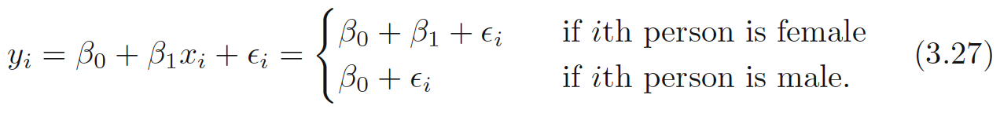
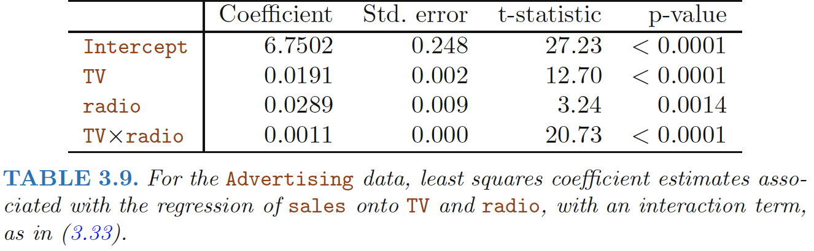

# Qualitative Predictors

## Predictors with Only Two Levels
Suppose that we wish to investigate differences in credit card balance between
males and females, ignoring the other variables for the moment. If a
qualitative predictor (also known as a **factor**) only has two **levels**, or possible values, then incorporating it into a regression model is very simple. We simply create an indicator or **dummy variable** that takes on two possible numerical values.

and use this variable as a predictor in the regression equation. This results
in the model

<!--more-->

Now β0 can be interpreted as the average credit card balance among males,
β0 + β1 as the average credit card balance among females 

## Qualitative Predictors with More than Two Levels

When a qualitative predictor has more than two levels, we can create
additional dummy variables. For example, for the ethnicity variable we
create two dummy variables. The first could be

and the second could be

Then both of these variables can be used in the regression equation, in
order to obtain the model

**Baseline**

- There will always be **one fewer** dummy variable
than the number of levels. The level with no dummy variable—African
American in this example—is known as the baseline.

The p-values associated with the coefficient estimates for
the two dummy variables are very large, suggesting no statistical evidence
of a real difference in credit card balance between the ethnicities

> The coefficients and their p-values do depend on the choice of dummy
variable coding

Rather than rely on the individual coefficients, we can use
an **F-test** to test H0 : β1 = β2 = 0; this does not depend on the coding.

This F-test has a p-value of 0.96, indicating that we cannot reject the null
hypothesis that there is no relationship between balance and ethnicity. 

# Extensions of the Linear Model

Two
of the most important assumptions state that the relationship between the
predictors and response are **additive** and **linear**. 
- **Additive**: the effect of changes in a predictor $X_j$ on the response $Y$ is
independent of the values of the other predictors
- **Linear**: the change in the response $Y$ due to a one-unit change in $X_j$ is
constant, regardless of the value of $X_j$

## Removing the Additive Assumption
Consider the standard linear regression model with two variables,
\begin{align}
Y = β_0 + β_1X_1 + β_2X_2 + \epsilon
\end{align}

One way of extending this model
to allow for interaction effects is to include a third predictor, called an
**interaction term**:

\begin{align}
Y = β_0 + β_1X_1 + β_2X_2 +  β_3X_1X_2 + \epsilon 
\end{align}

**How does inclusion of this interaction term relax the additive assumption?**

The model above could be written as:
\begin{align}
Y &= β_0 + (β_1+β_3X_2)X_1 + β_2X_2 + \epsilon  \\
&= β_0 + \tilde{β}_1X_1 + β_2X_2 + \epsilon
\end{align}

Since $\tilde{β}_1$ changes with $X_2$, the effect of $X_1$ on $Y$ is
no longer constant: adjusting $X_2$ will change the impact of $X_1$ on $Y$.

- Sometimes the case that an interaction term has a very small p-value, but
the associated main effects (in this case, TV and radio) do not. 
- The **hierarchical
principle** states that if we include an interaction in a model, we
should also include the **main effects**, even if the p-values associated with 
their coefficients are not significant. (If the interaction between
X1 and X2 seems important, we should include both X1 and
X2 in the model even if their coefficient estimates have large p-values)

**Concept of
interactions applies on qualitative variables**

Adding an interaction variable, model now becomes:

## Non-linear Relationships

Extending the linear model
to accommodate non-linear relationships is known as **polynomial regression**,
since we have included **polynomial functions** of the predictors in the
regression model 

# Potential Problems 

## Non-linearity of the Data
**Assumption**: The linear regression model assumes that there is a straight-line relationship
between the predictors and the response.

**Residual plots**: graphical tool for identifying non-linearity
- Given a simple linear regression model, we can plot the residuals,$e_i = y_i-\hat{y_i}$ versus the predictor $x_i$, or $\hat{y_i}$ when there are  multiple predictors

- Ideally, the residual plot will show no discernible pattern.
- If the residual plot indicates non-linear associations in the
data, then a simple approach is to use **non-linear transformations** of the
predictors, such as $\log{X},\sqrt{X}, X^2$, in the regression model. 

## Correlation of Error Terms 

**Assumption**: The error terms, $\epsilon_1,\epsilon_2,...,\epsilon_n$, are uncorrelated.

-  If the errors are uncorrelated, then the fact that i is positive provides little or no information about the sign of i+1.
-  If the error terms are correlated, we may have an unwarranted sense of confidence in our model.
 - **estimated standard errors** will underestimate the true standard errors.
 -  **confidence and prediction intervals** will be narrower than they should be. For example, a 95% confidence interval may in reality have a much lower probability than 0.95 of containing the true value of the parameter. 
 - **p-values** will be lower than they should be
 - Lead to erroneously conclude that a parameter is statistically significant. 

**Why might correlations among the error terms occur?**
- Such correlations
frequently occur in the context of **time series** data
- In many cases, observations that are obtained at adjacent time points will
have **positively correlated errors**. 
- Plot the residuals from our model as a function of time to identify this correlation. 
 - **Tracking**: If the error terms are positively correlated, then
we may see **tracking** in the residuals—that is, adjacent residuals may have similar values.

## Non-constant Variance of Error Terms

**Assumption**: the error terms have a constant variance, $Var(\epsilon_i) = σ^2$.
- The standard errors,
confidence intervals, and hypothesis tests associated with the linear model
rely upon this assumption.

The variances of the error terms are non-constant. 
- For instance, the variances of the error terms may increase with the value of the response. 
- One can identify non-constant variances in
the errors, or **heteroscedasticity**异方差性,from the presence of a funnel shape in residual plot.
- **Solution**: transform the response Y using a concave function such as $\log{Y}$ or $\sqrt{Y}$ . Such
a transformation results in a greater amount of shrinkage of the larger responses,
leading to a reduction in **heteroscedasticity**.

## Outliers 

**Outlier**: is a point for which $y_i$ is far from the value predicted by the model. Outliers can arise for a variety of reasons, such as incorrect recording of an observation during data collection.

**Problems of Outlier**:
- Effect on the least squares fit,
- Effect on interpretation of the fit
 - For instance, in this example, the RSE is 1.09 when the
outlier is included in the regression, but it is only 0.77 when the outlier
is removed.

**Residual Plots** can be used to identify outliers

- Difficult to decide how large a residual
needs to be

**Studentized residuals**: computed by dividing each residual $e_i$ by its estimated standard error.
- Observations whose studentized residuals are greater than 3 in abso- residual
lute value are possible outliers.

## High Leverage Points 

**High Leverage**:Observations with high leverage have an unusual value for xi
- removing the high leverage observation has a much more substantial impact on the least squares line
than removing the outlier.

**Leverage Statistic**: quantify an observation’s leverage

For a simple linear regression

$$
\begin{align}
h_i=\frac{1}{n}+\frac{(x_i-\bar{x})^2}{\sum_{i^{'}=1}^n (x_{i^{'}}-\bar{x})^2}
\end{align}
$$

- $h_i$ increases with the distance of $x_i$ from $\bar{x}$.
- $h_i$ is always between 1/n and 1, and the **average leverage** for all the observations is
always equal to $(p+1)/n$. 
- **High leverage**: a leverage statistic that greatly exceeds $(p+1)/n$, high leverage.

The right-hand panel of Figure 3.13 provides a plot of the studentized
residuals versus $h_i$ for the data in the left-hand panel of Figure 3.13. Observation
41 stands out as having a very high leverage statistic as well as a
high studentized residual. In other words, it is an outlier as well as a high
leverage observation.

## Collinearity 

Collinearity: situation in which two or more predictor variables are closely related to one another.

**Problems of Collinearity**

- Difficult to separate out the individual
effects of collinear variables on the response
- Uncertainty in the
coefficient estimates.
- Causes the standard error for $\hat{β_j}$ to grow
 - Recall that the
t-statistic for each predictor is calculated by dividing $\hat{β_j}$ by its standard
error. Consequently, collinearity results in a decline in the t-statistic. As a
result, in the presence of collinearity, we may fail to reject H0 : βj = 0. This
means that the **power** of the hypothesis test—the probability of correctly
detecting a non-zero coefficient—is reduced by collinearity.

**Detection of Collinearity**

- **Correlation matrix**
of the predictors.
 - An element of this matrix that is large in absolute value
indicates a pair of highly correlated variables.
 - **Situation Multicollinearity**: it is possible for collinearity
to exist between three or more variables even if no pair of variables
has a particularly high correlation
- **Variance Inflation Factor (VIF)**
 - The ratio of the variance of $\hat{β_j}$ when fitting the full model divided by the
variance of $\hat{β_j}$ if fit on its own. The smallest possible value for VIF is 1,
which indicates the complete absence of collinearity.
 - A VIF value that exceeds 5 or 10 indicates a problematic amount of collinearity. 

 The VIF for each variable,

where $R^2_{X_j|X_{-j}}$ is the $R^2$ from a regression of $X_j$ onto all of the other
predictors. If $R^2_{X_j|X_{-j}}$ is close to one, then collinearity is present, and so
the VIF will be large.

**Solution of Collinearity**

- Drop one of the problematic variables from the regression.
- Combine the collinear variables together into a single predicto
 - E.g.: take the average of standardized versions of limit and
rating in order to create a new variable that measures credit worthiness

------

**Ref:**

James, Gareth, et al. *An introduction to statistical learning*. Vol. 112. New York: springer, 2013.

Hastie, Trevor, et al. "The elements of statistical learning: data mining, inference and prediction." *The Mathematical Intelligencer* 27.2 (2005): 83-85