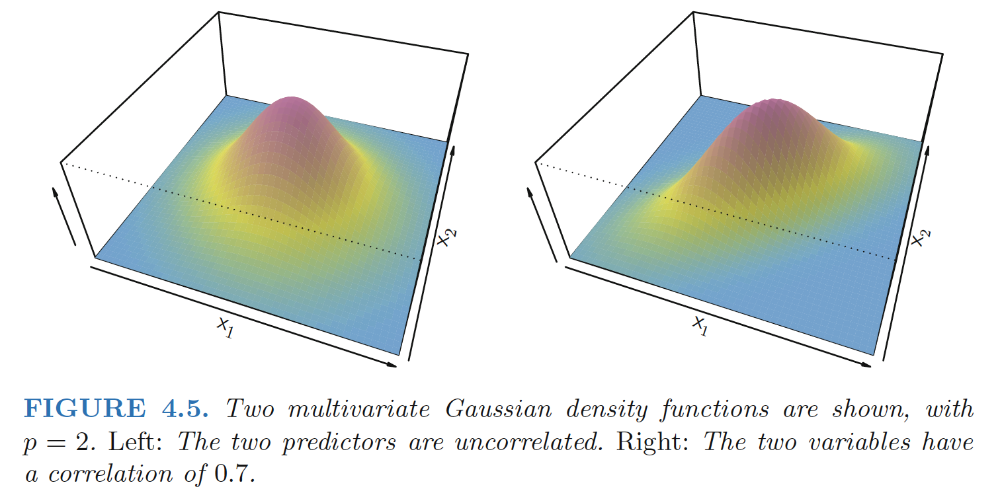
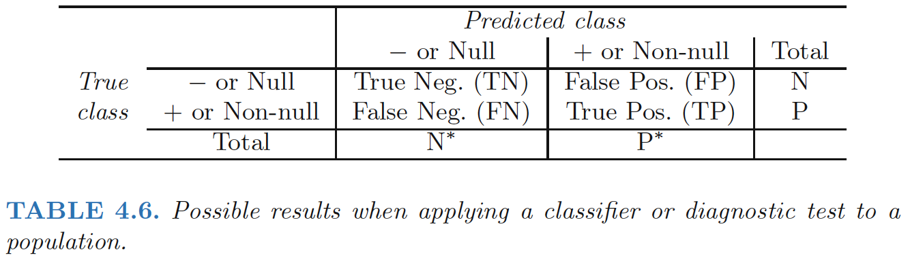

**LDA V.S. Logistic Regression**:
    

1. When the classes are well-separated, the parameter estimates for the
logistic regression model are surprisingly unstable. Linear discriminant
analysis does not suffer from this problem.
2. If n is small and the distribution of the predictors X is approximately
normal in each of the classes, the linear discriminant model is again
more stable than the logistic regression model.
3. Linear discriminant analysis is popular
when we have more than two response classes.

<!--more-->

# Using Bayes’ Theorem for Classification
Suppose that we wish to classify an observation into one of K classes, where
K ≥ 2.

**Prior**:Let $\pi_k=Pr(Y=k)$ represent the overall or ***prior***
probability that a randomly chosen observation comes from the kth class. This is the probability that a given observation is associated with the kth
category of the response variable Y . 

Let $f_k(X) ≡ Pr(X = x|Y = k)$ denote
the ***density function*** of X for an observation that comes from the kth class. In other words, fk(x) is relatively large if there is a high probability that an observation in the kth class has X ≈ x.

**Bayes’ theorem** states that
$$
\begin{align}
Pr(Y=k|X=x)=\frac{\pi_k f_k(x)}{\sum_{l=1}^K\pi_lf_l(x)} 
\end{align}
$$
**Posterior**:$p_k(X)
= Pr(Y = k|X)$ an observation X = x belongs to the kth class, given the predictor value for that
observation

**Estimating $π_k$:** simply compute the fraction of the training
observations that belong to the kth class.

**Estimating $f_k(X)$:** more challenging

# Linear Discriminant Analysis for p = 1

Assume p = 1—that is, we have only one predictor. We
would like to obtain an estimate for $f_k(x)$ that we can estimate $p_k(x)$. We will then classify an observation to the class
for which $p_k(x)$ is greatest. 

## Assumptions
In order to estimate $f_k(x)$, we will first make
some assumptions about its form:

1. Assume that $f_k(x)$ is normal or Gaussian.
  $$
  \begin{align}
  f_k(x)=\frac{1}{\sqrt{2\pi}\sigma_k}\exp{\left( -\frac{1}{2\sigma_k^2}(x-\mu_k)^2 \right)}
  \end{align}
  $$
  

where $μ_k$ and $σ_k^2$ are the mean and variance parameters for the kth class.

2. Assume that $\sigma_1^2=...=\sigma_k^2$
: that is, there is a shared
variance term across all K classes, which for simplicity we can denote by
$\sigma^2$.

So
$$
\begin{align}
p_k(x)=\frac{\pi_k \frac{1}{\sqrt{2\pi}\sigma}\exp{\left( -\frac{1}{2\sigma^2}(x-\mu_k)^2 \right)}}{\sum_{l=1}^K\pi_l\frac{1}{\sqrt{2\pi}\sigma}\exp{\left( -\frac{1}{2\sigma^2}(x-\mu_l)^2 \right)}}
\end{align}
$$
The **Bayes classifier** involves assigning an observation X = x to the class for which $p_k(x)$ is largest. Taking the log of $p_k(x)$
and rearranging the terms, it is not hard to show that this is equivalent to
assigning the observation to the class for which
$$
\begin{align}
\delta_k(x)=x\frac{\mu_k}{\sigma^2}-\frac{\mu_k^2}{2\sigma^2}+\log(\pi_k) \quad\quad (4.13)
\end{align}
$$
is largest.

For instance, if K = 2 and π1 = π2, then the Bayes classifier
assigns an observation to class 1 if $2x (μ_1 − μ_2) > μ^2_1
− μ^2_2$, and to class
2 otherwise. In this case, the Bayes decision boundary corresponds to the
point where
$$
\begin{align}
x=\frac{\mu_1^2-\mu_2^2}{2(\mu_1-\mu_2)}=\frac{\mu_1+\mu_2}{2}
\end{align}
$$

## Parameters Estimation

In practice, even if we are quite certain of our assumption that X is drawn
from a Gaussian distribution within each class, we still have to estimate
the parameters $μ_1, . . . , μ_K, π_1, . . . , π_K$, and $σ^2$.

**Linear discriminant analysis (LDA)** method approximates the Bayes classifier by plugging estimates for $μ_1, . . . , μ_K, π_1, . . . , π_K$, and $σ^2$ into (4.13)

$$
\begin{align}
\hat{\mu}_k=\frac{1}{n_k}\sum_{i:y_i=k}x_i  \quad (4.15) \\
\hat{\sigma}^2=\frac{1}{n-K}\sum_{k=1}^K\sum_{i:y_i=k}(x_i-\hat{\mu_k})^2 \quad (4.16)\\
\hat{\pi_k}=\frac{n_k}{n}
\end{align}
$$

where n is the total number of training observations, and $n_k$ is the number
of training observations in the kth class. 

$\hat{\mu}_k$: average of all the training observations from the kth class;

$\hat{\sigma}^2$: a weighted average of the sample variances for each of the K classes.

$\hat{\pi_k}$: the proportion of the training observations
that belong to the kth class

##  LDA classifier
The LDA classifier assigns an observation X = x to the class for which

$$
\begin{align}
\hat{\delta}_k(x)=x\frac{\hat{\mu}_k}{\hat{\sigma}^2}-\frac{\hat{\mu}_k^2}{2\hat{\sigma}^2}+\log(\hat{\pi}_k)
\end{align}
$$
is largest.

The word ***linear*** in the classifier’s name stems from the fact
that the ***discriminant functions*** $\hat{\delta}_k(x)$ are linear functions of x.

The right-hand panel of Figure 4.4 displays a histogram of a random
sample of 20 observations from each class. 

To implement LDA,

1. Estimating πk, μk, and σ2 using (4.15) and (4.16).
2. Compute the decision boundary, shown as a black solid line, that results from assigning an observation to the class for which $\hat{\delta}_k(x)$ is largest.

In this case, since n1 = n2 = 20,
we have $\hat{\pi_1}$ = $\hat{\pi_2}$. As a result, the decision boundary corresponds to the
midpoint between the sample means for the two classes,$\frac{\mu_1+\mu_2}{2}$

# Linear Discriminant Analysis for p >1 

Assume that X = (X1,X2, . . .,Xp) is drawn from a **multivariate Gaussian** (or multivariate normal) distribution, with a class-specific mean vector and a common covariance matrix.

## Multivariate Gaussian Distribution

Assumes that each individual predictor
follows a one-dimensional normal distribution with some
correlation between each pair of predictors.

To indicate that a p-dimensional random variable X has a multivariate
Gaussian distribution, we write X ∼ N(μ,Σ). Here E(X) = μ is
the mean of X (a vector with p components), and Cov(X) = Σ is the
p × p **covariance matrix** of X. Formally, the **multivariate Gaussian density**
is defined as
$$
\begin{align}
f(x)=\frac{1}{\sqrt{(2\pi)^{p}|Σ|}}\exp{\left( \frac{1}{2}(x-\mu)^TΣ^{-1}(x-\mu) \right)}
\end{align}
$$
In the case of p > 1 predictors, the **LDA classifier** assumes that the
observations in the kth class are drawn from a multivariate Gaussian distribution
$N(μ_k,Σ)$, where $μ_k$ is a class-specific mean vector, and Σ is a
covariance matrix that is common to all K classes.

Plugging the density function for the kth class, $f_k(X = x)$, into $Pr(Y = k|X = x)$, the Bayes classifier assigns an observation X = x
to the class for which
$$
\begin{align}
\delta_k(x)=x^TΣ^{-1}\mu_k-\frac{1}{2}\mu_k^TΣ^{-1}\mu_k+\log{\pi_k}  \quad \quad (4.19)
\end{align}
$$
is largest.

Once again, we need to estimate the unknown parameters $μ_1, . . . , μ_K$,
$π_1, . . . , π_K$, and Σ; the formulas are similar to those used in the one dimensional
case, given in (4.15). To assign a new observation X = x,
**LDA** plugs these estimates into (4.19) and classifies to the class for which
$\hat{\delta}_k(x)$ is largest.

> Overall, the LDA decision boundaries are
pretty close to the Bayes decision boundaries, shown again as dashed lines.

## Caveats

1. Training error rates will usually be lower than test error
rates. The higher the ratio of parameters p to number
of samples n, the more we expect this overfitting to play a role.

2. Second, since only 3.33% of the individuals in the training sample
defaulted, a simple but useless classifier that always predicts that each individual will not default, regardless of his or her credit card
balance and student status, will result in an error rate of 3.33%. In
other words, the trivial **null classifier** will achieve an error rate that is only a bit higher than the LDA training set error rate.

### Two Types of Error, Confusion Matrix

Binary classifier can make two types of
errors:

1. it can incorrectly assign an individual who defaults to the no default
category;
2. it can incorrectly assign an individual who does not default to
the default category.

**Confusion Matrix**

*注意这张图不是标准的confusion matrix，看下面那张

**Explanation**：
The matrix
table reveals that LDA predicted that a total of 104 people would default.
Of these people, 81 actually defaulted and 23 did not. 

**Type I Error**： Of the 333 individuals who defaulted, 252 (or 75.7%) were missed by LDA. So while the overall error
rate is low, the error rate among individuals who defaulted is very high.
From the perspective of a credit card company that is trying to identify
high-risk individuals, an error rate of 252/333 = 75.7% among individuals
who default may well be unacceptable.

**Type II Error**：Only 23 out
of 9, 667 of the individuals who did not default were incorrectly labeled.
This looks like a pretty low error rate! 

**Sensitivity**:the percentage of
true defaulters that are identified, a low 24.3% in this case.

**Specificity**:the percentage of non-defaulters that are correctly identified, here (1 −
23/9, 667)× 100 = 99.8%.

### Why does LDA do such a poor job of classifying the customers who default?

>In other words, why does it have such a low sensitivity? 

LDA is trying to approximate the Bayes classifier, which has the lowest
total error rate out of all classifiers (if the Gaussian model is correct).
That is, the Bayes classifier will yield the smallest possible total number
of misclassified observations, irrespective of which class the errors come
from.

The Bayes classifier works by assigning an observation to the class for
which the posterior probability pk(X) is greatest. In the two-class case, this
amounts to assigning an observation to the default class if $Pr(default = Yes|X = x) > 0.5.$

Thus, the Bayes classifier, and by extension LDA, uses a threshold of 50%
for the posterior probability of default in order to assign an observation
to the default class.

**Modify LDA**

If we are concerned about incorrectly predicting
the default status for individuals who default, then we can consider
lowering this threshold.

$$P(default = Yes|X = x) > 0.2$$

Figure 4.7 illustrates the trade-off that results from modifying the threshold
value for the posterior probability of default

How can we decide which threshold value is
best? Such a decision must be based on **domain knowledge**, such as detailed
information about the costs associated with default.

### ROC & AUC

**ROC**:The ROC curve is a popular graphic for simultaneously displaying the
two types of errors for all possible thresholds.

**AUC**: The overall performance of a classifier, summarized
over all possible thresholds, is given by the area under the (ROC)
curve (AUC).

 - An ideal ROC curve will hug the top left corner, so the larger
the AUC the better the classifier. We expect
a classifier that performs no better than chance to have an AUC of 0.5

 - ROC curves are useful for comparing different classifiers, since they take
into account all possible thresholds.

# Quadratic Discriminant Analysis 

**Quadratic discriminant analysis (QDA)** classifier results from assuming that the
observations from each class are drawn from a Gaussian distribution, and
plugging estimates for the parameters into Bayes’ theorem in order to perform
prediction. 

However, unlike LDA, **QDA assumes that each class has
its own covariance matrix**. That is, it assumes that an observation from the
kth class is of the form $X ∼ N(μ_k,Σ_k)$, where $Σ_k$ is a covariance matrix
for the kth class. Under this assumption, the Bayes classifier assigns an
observation $X = x$ to the class for which

$$
\begin{align}
\delta_k(x)&=-\frac{1}{2}(x-\mu_k)^TΣ_k^{-1}(x-\mu_k)-\frac{1}{2}\log{|Σ_k|}+\log{\pi_k} \\
&=-\frac{1}{2}x^TΣ_k^{-1}x+x^TΣ_k^{-1}\mu_k-\frac{1}{2}\mu_k^TΣ_k^{-1}\mu_k-\frac{1}{2}\log{|Σ_k|}+\log{\pi_k}
\end{align}
$$

is largest.

So the QDA classifier involves plugging estimates for $Σ_k, μ_k, π_k$ into $\delta_k(x)$, and then assigning an observation $X = x$ to the class
for which this quantity is largest. Unlike LDA, the quantity $x$ appears
as a quadratic function.

## Why does it matter whether or not we assume that the K classes share a common covariance matrix?

The answer lies in the **bias-variance trade-off**:
 - When there are p predictors, then estimating a covariance matrix requires estimating
p(p+1)/2 parameters. QDA estimates a separate covariance matrix
for each class, for a total of Kp(p+1)/2 parameters.
 - Consequently, LDA is a much less flexible classifier than QDA, and
so has substantially lower variance. 
 - But there is a trade-off: if LDA’s assumption that
the K classes share a common covariance matrix is badly off, then LDA
can suffer from high bias. 

**Conclusion**

- LDA tends to be a better bet
than QDA if there are relatively few training observations and so reducing
variance is crucial. 
- QDA is recommended if the training set is
very large, so that the variance of the classifier is not a major concern, or if
the assumption of a common covariance matrix for the K classes is clearly
untenable

------

**Ref:**

James, Gareth, et al. *An introduction to statistical learning*. Vol. 112. New York: springer, 2013.

Hastie, Trevor, et al. "The elements of statistical learning: data mining, inference and prediction." *The Mathematical Intelligencer* 27.2 (2005): 83-85