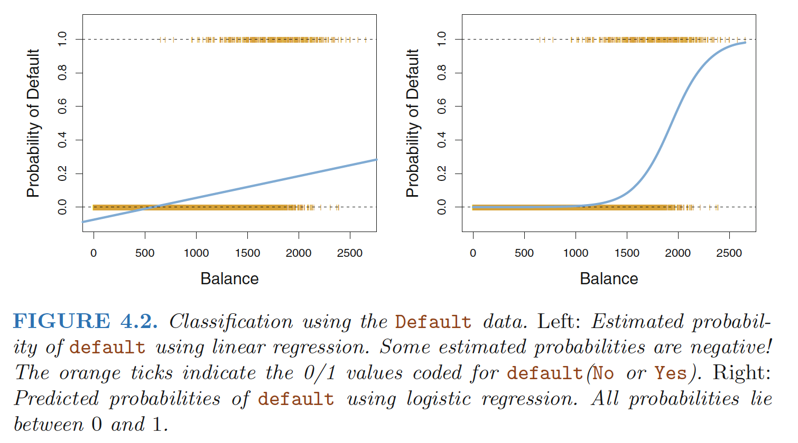
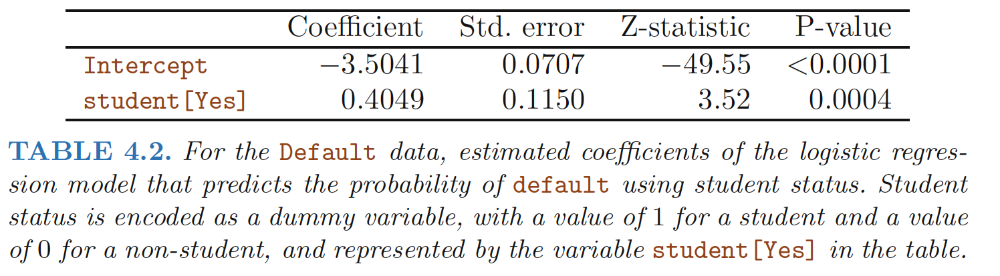
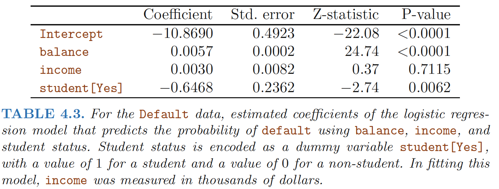
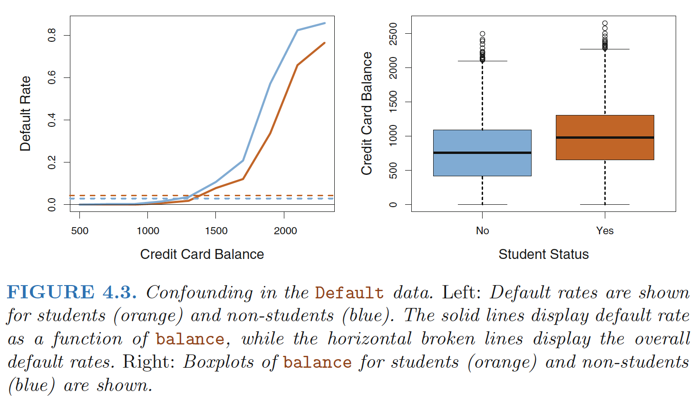

# Why Not Linear Regression?

The logistic regression model arises from the desire to model the posterior probabilities of the K classes via linear functions in x, while at the same time ensuring that they sum to one and remain in [0, 1]. The model has the form:
$$
\begin{align}
\log\frac{\text{Pr}(G=1|X=x)}{\text{Pr}(G=K|X=x)} &= \beta_{10} + \beta_1^Tx \\
\log\frac{\text{Pr}(G=2|X=x)}{\text{Pr}(G=K|X=x)} &= \beta_{20} + \beta_2^Tx \\
&\vdots \\
\log\frac{\text{Pr}(G=K-1|X=x)}{\text{Pr}(G=K|X=x)} &= \beta_{(K-1)0} + \beta_{K-1}^Tx \\
\end{align}
$$

Linear regression is not appropriate in the case of a qualitative response.**

 **Reason:** there is no natural way to
convert a qualitative response variable with more than two levels into a
quantitative response that is ready for linear regression.

**Setting**: For the Default data, logistic regression models the probability of default.
For example, the probability of default given balance can be written as $Pr(default = Yes|balance).$

<!--more-->

# The Logistic Model

Logistic regression involves directly modeling Pr(Y = k|X = x) using the
logistic function for the case of two response classes

**Logistic function:**

$$
\begin{align}
p(X)=\frac{e^{\beta_0+\beta_1X}}{1+e^{\beta_0+\beta_1X}} \\
\frac{p(X)}{1-p(X)}=e^{\beta_0+\beta_1X}
\end{align}
$$
**Odds**

The quantity p(X)/[1−p(X)] is called the **odds**, and can take on any value
odds
between 0 and ∞. Values

**Log-odds (Logit)**

$$
\begin{align}
\log{\frac{p(X)}{1-p(X)}}=\beta_0+\beta_1X
\end{align}
$$
We see that the logistic model (4.2) has a logit that is linear in X.

- There is not a straight-line relationship between p(X)
and X,

- The rate of change in p(X) per unit change in X
depends on the current value of X,

# Estimating the Regression Coefficients

The basic intuition behind using **maximum likelihood**
to fit a logistic regression model is as follows: 
 - We seek estimates for $β_0$ and
$β_1$ such that the predicted probability $\hat{p}(x_i)$ of class "default" for each individual,
using (4.2), corresponds as closely as possible to the individual’s observed
"default" status. In other words, we try to find $\hat{β}_0$ and $\hat{β}_1$ such that plugging
these estimates into the model for $p(X)$, given in (4.2), yields a number
close to one for all individuals who "defaulted", and a number close to zero
for all individuals who did not.

**Likelihood function**:

$$
\begin{align}
l(\beta_0,\beta_1)=\prod_{i:y_i=1}p(x_i) \prod_{i^{'}:y_{i^{'}}=0}(1-p(x_{i^{'}}))
\end{align}
$$
The estimates $\hat{\beta_0}$ and $\hat{\beta_1}$ are chosen to maximize this ***likelihood function.***

In the
linear regression setting, the least squares approach is in fact a special case
of maximum likelihood.

# Making Predictions

Once the coefficients have been estimated, it is a simple matter to compute
the probability of default for any given credit card balance.

For example,
using the coefficient estimates given in Table 4.1, we predict that the default
probability for an individual with a balance of $1, 000 is
$$
\begin{align}
\hat{p}(X)=\frac{e^{\hat{\beta_0}+\hat{\beta_1}X}}{1+e^{\hat{\beta_0}+\hat{\beta_1}X}}=\frac{e^{−10.6513+0.0055×1,000}}{1+e^{−10.6513+0.0055×1,000}}=0.00576
\end{align}
$$

# Multiple Logistic Regression

We now consider the problem of predicting a binary response using multiple
predictors

**Log-odds (Logit)**

$$
\begin{align}
\log{\frac{p(X)}{1-p(X)}}=\beta_0+\sum_{i=1}^p\beta_iX
\end{align}
$$
where X = (X1, . . .,Xp) are p predictors

**Logistic function:**

$$
\begin{align}
p(X)=\frac{e^{\beta_0+\sum_{i=1}^p\beta_iX}}{1+e^{\beta_0+\sum_{i=1}^p\beta_iX}} \\
\frac{p(X)}{1-p(X)}=e^{\beta_0+\sum_{i=1}^p\beta_iX}
\end{align}
$$

## Confounding
In single variable setting: 

In multiple variables setting:

>How is it possible for student status to be associated with an
increase in probability of default in Table 4.2 and a decrease in probability
of default in Table 4.3?

- The positive coefficient for student in the single variable logistic regression : the overall student
default rate is higher than the non-student default rate
- The negative coefficient for student in
the multiple logistic regression: for a fixed value of balance
and income, a student is less likely to default than a non-student. 

**Reason**:The variables *student* and *balance* are correlated.

**Intuition**: A student is
riskier than a non-student if no information about the student’s credit card
balance is available. However, that student is less risky than a non-student
with the same credit card balance!

------

**Ref:**

James, Gareth, et al. *An introduction to statistical learning*. Vol. 112. New York: springer, 2013.

Hastie, Trevor, et al. "The elements of statistical learning: data mining, inference and prediction." *The Mathematical Intelligencer* 27.2 (2005): 83-85