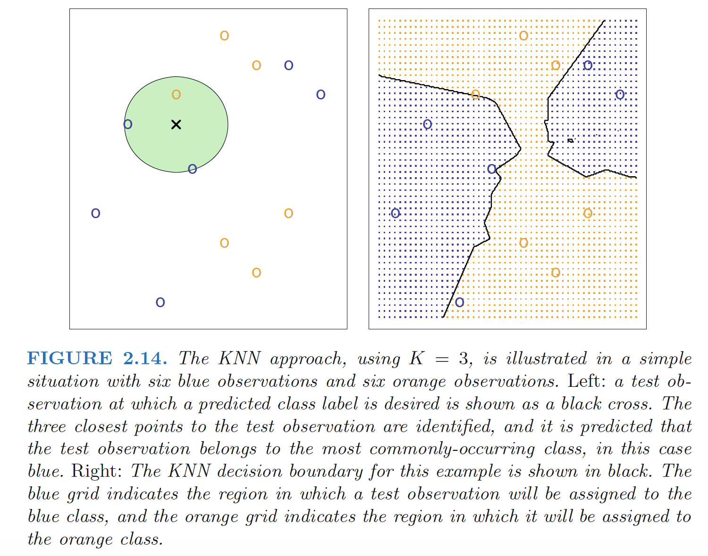

***no free lunch in statistics***: no one method dominates all others over all possible data sets. 

 - Explanation: On a particular data set, one specific method may work best, but some other method may work better on a similar but different data set. Hence it is an important task to decide for any given set of data which method produces the best results.

# Measuring the Quality of Fit
## mean squared error (MSE)

$$
\begin{align}
MSE=\frac{1}{n}\sum_{i=1}^{n}(y_i-\hat{f}(x_i))^2
\end{align}
$$

***overfitting***: When a given method yields a small training MSE but a large test MSE.

 - Explanation: a less flexible model would have yielded a smaller test MSE. This happens because our statistical learning procedure is working too hard to find patterns in the training data, and may be picking up some patterns that are just caused by random chance rather than by true properties of the unknown function f.

<!--more-->

# The Bias-Variance Trade-Off

## Decomposition
The expected test MSE, for a given value $x_0$ can always be decomposed into the sum of three fundamental quantities: **the variance of $\hat{f}(x_0)$, the squared bias of $\hat{f}(x_0)$, and the variance of the error
variance terms $\epsilon$.**
$$
\begin{align}
E(y_0-\hat{f}(x_0))^2=Var(\hat{f}(x_0))+[Bias(\hat{f}(x_0))]^2+Var(\epsilon)
\end{align}
$$
The overall expected test MSE can be computed by averaging $E(y_0-\hat{f}(x_0))^2$ over all possible values of x0 in the test set.

### Variance
***Variance***: refers to the amount by which $\hat{f}$ would change if we estimated it using a different training data set. ***more flexible statistical methods have higher variance***
 - Explanation: different training data sets will result in a different $\hat{f}$. But ideally the estimate for f should not vary too much between training sets. However, if a method has high variance then small changes in the training data can result in large changes in $\hat{f}$

### Bias
***bias***: refers to the error that is introduced by approximating a real-life problem, which may be extremely complicated, by a much simpler model.
 - Explanation: As we increase the flexibility of a class of methods, the bias tends to initially decrease faster than the variance increases. Consequently, the expected test MSE declines. However, at some point increasing flexibility has little impact on the bias but starts to significantly increase the variance. When this happens the test MSE increases.

   
   

-----

### Math Explanation
**Math Explanation**: If we assume that $Y=f(X)+\epsilon$ where $E(\epsilon)=0$, and $Var(\epsilon)=\sigma^2_\epsilon$, we can derive an expression for the expected prediction error of a regression fit $\hat{f}(X)$ at an input point X = x0, using squared-error loss:
$$
\begin{align}
Err(x_0)&=E[(Y-\hat{f}(x_0))^2|X=x_0] \\
&=E[(f(x_0)+\epsilon-\hat{f}(x_0))^2] \\
&=E[\epsilon^2+(f(x_0)-\hat{f}(x_0))^2+2\epsilon(f(x_0)-\hat{f}(x_0))] \\
&=\sigma^2_\epsilon+E[f(x_0)^2+\hat{f}(x_0)^2-2f(x_0)\hat{f}(x_0)] \\
&=\sigma^2_\epsilon+E[\hat{f}(x_0)^2]+f(x_0)^2-2f(x_0)E[\hat{f}(x_0)]  \\
&=\sigma^2_\epsilon+(E[\hat{f}(x_0)])^2+f(x_0)^2-2f(x_0)E[\hat{f}(x_0)] +E[\hat{f}(x_0)^2]-(E[\hat{f}(x_0))^2 \\
&=\sigma^2_\epsilon+(E\hat{f}(x_0)-f(x_0))^2+Var(\hat{f}(x_0))\\
&=\sigma^2_\epsilon+Bias^2(\hat{f}(x_0))+Var(\hat{f}(x_0))\\
&= Irreducible Error+ Bias^2 + Variance
\end{align}
$$

1. The first term is the variance of the target around its true mean f(x0), and cannot be avoided no matter how well we estimate f(x0), unless $\sigma^2_\epsilon=0$
2. The second term is the squared bias, the amount by which the average of our estimate differs from the true mean
3. The last term is the variance; the expected squared deviation of $\hat{f}(x_0)$ around its mean. 

>Typically the more complex we make the model $\hat{f}$, the lower the (squared) bias but the higher the variance.

# The Classification Setting

***training error rate***： $\frac{1}{n}\sum_{i=1}^nI(y_i\neq\hat{y}_i)$

Here $\hat{y}_i$ is the predicted class label for the ith observation using $\hat{f}$

***test error rate***： $Ave (I(y_0 \neq \hat{y}_0))$

where $\hat{y}_0$ is the predicted class label that results from applying the classifier to the test observation with predictor x0. A good classifier is one for which the test error is smallest.

## The Bayes Classifier
**Bayes classifier**: $Pr(Y=j|X=x_0)$
 - **Explanation**: The test error rate given in $Ave (I(y_0 \neq \hat{y}_0))$ is minimized, on average, by a very simple classifier that assigns each observation to the most likely class, given its predictor values. 
 - **Example**: In a two-class problem where there are only two possible response values, say class 1 or class 2, the Bayes classifier corresponds to predicting class one if $Pr(Y=1|X=x_0)$> 0.5, and class two otherwise.
 - **Disadvantage**: For real data, we do not know the conditional distribution of Y given X, and so computing the Bayes classifier is impossible. Therefore, the Bayes classifier serves as an unattainable gold standard against which to compare other methods 

**Bayes error rate**: $1-E\left(\max_jPr(Y=j|X)\right)$

Since the Bayes classifier will always choose the class Bayes error $Pr(Y=j|X=x_0)$ is largest, the error rate at X = x0 will be $1-\max_jPr(Y=j|X)$

## K-Nearest Neighbors
**K-nearest neighbors (KNN) classifier**: 
1. Given a positive integer $K$ and a test observation $x_0$, the KNN classifier first identifies the neighbors $K$ points in the training data that are closest to $x_0$, represented by $N_0$. 

2. It then estimates the conditional probability for class $j$ as the fraction of points in $N_0$ whose response values equal $j$: 
  $$
  \begin{align}
  Pr(Y=j|X=x_0)=\frac{1}{K}\sum_{i\in N_0} I(y_i=j)
  \end{align}
  $$
  
3. Finally, KNN applies Bayes rule and classifies the test observation $x_0$ to the class with the largest probability.

As K grows, the method becomes less flexible and
produces a decision boundary that is close to linear. This corresponds to
a low-variance but high-bias classifier.

As we use more flexible classification methods, the training error
rate will decline but the test error rate may not.

------

**Ref:**

James, Gareth, et al. *An introduction to statistical learning*. Vol. 112. New York: springer, 2013.

Hastie, Trevor, et al. "The elements of statistical learning: data mining, inference and prediction." *The Mathematical Intelligencer* 27.2 (2005): 83-85