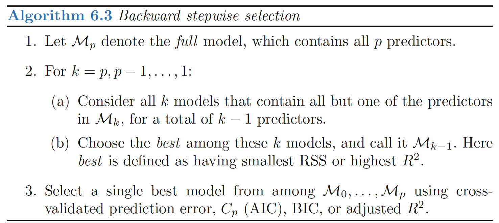
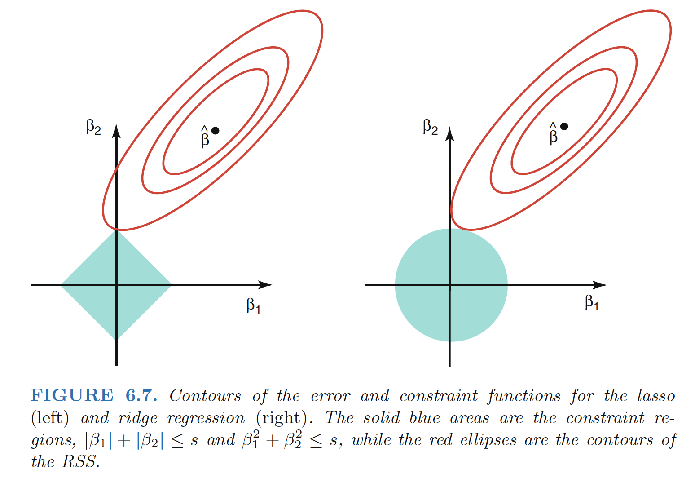

# Introduction to Model Selection

**Setting:**

- In the regression setting, the standard linear model
$Y = β_0 + β_1X_1 + · · · + β_pX_p + \epsilon$

- In the chapters that follow, we consider some approaches for extending
the linear model framework.

**Reason of using other fitting procedure than lease squares**:

- ***Prediction Accuracy:*** 
   - Provided that the true relationship between the response and the predictors is approximately linear, the least squares estimates will have low bias. 
   - If n $\gg$ p, least squares estimates tend to also have low variance $\Rightarrow$ perform well on test data.
   - If n is not much larger than p, least squares fit has large variance $\Rightarrow$ overfitting $\Rightarrow$ consequently poor predictions on test data
   - If p > n, no more unique least squares coefficient estimate: the **variance is infinite** so the method cannot be used at all

   By **constraining** or **shrinking** the estimated coefficients, we can often substantially reduce the variance at the cost of a negligible increase in bias.

- ***Model Interpretability***：
   - irrelevant variables leads to unnecessary complexity in the resulting model. By removing these
  variables—that is, by setting the corresponding coefficient estimates
  to zero—we can obtain a model that is more easily interpreted. 
   - least squares is extremely unlikely to yield any coefficient estimates that are exactly zero $\Rightarrow$ **feature selection**

**Alternatives of lease squares:**

1. Subset Selection
2. Shrinkage
3. [Dimension Reduction](https://nancyyanyu.github.io/posts/cac93a23/)

<!--more-->

# Subset Selection

#### Drawbacks of least squares estimates:

- *prediction accuracy*: the least squares estimates often have low bias but large variance. Prediction accuracy can sometimes be improved by shrinking or setting some coefficients to zero.By doing so we sacrifice a little bit of bias to reduce the variance of the predicted values, and hence may improve the overall prediction accuracy.
- *interpretation*: With a large number of predictors, we often would like to determine a smaller subset that exhibit the strongest effects. In order to get the “big picture,” we are willing to sacrifice some of the small details.

## Best Subset Selection

Best subset regression finds for each k ∈{0, 1, 2,...,p} the subset of size k that gives smallest residual sum of squares.

We choose the smallest model that minimizes an estimate of the expected prediction error.

> FIGURE 3.5.All possible subset models for the prostate cancer example. At each subset size is shown the residual sum-of-squares for each model of that size.

**Approach**

1. fit a separate least squares regression best subset for each possible combination of the p predictors. That is, we fit all p models selection that contain exactly one predictor, all $\left(\begin{array}{c}p\\ 2\end{array}\right)= p(p−1)/2$ models that contain exactly two predictors, and so forth. 
2. We then look at all of the resulting
   models, with the goal of identifying the one that is best.

**Note**

- $RSS$ of these p + 1 models decreases monotonically, and the $R2$ increases
  monotonically, as the number of features included in the models increases.
  Therefore, if we use these statistics to select the best model, then we will
  always end up with a model involving all of the variables
- The problem of selecting the best model from among the $2^p$ possibilities
  considered by best subset selection is not trivial.

## Stepwise Selection

> Rather than search through all possible subsets (which becomes infeasible for p much larger than 40), we can seek a good path through them.

### Forward Stepwise Selection

**Forward-stepwise selection** starts with the intercept, and then sequentially adds into the model the predictor that most improves the fit.

Forward-stepwise selection is a *greedy algorithm*, producing a nested sequence of models. In this sense it might seem sub-optimal compared to best-subset selection. 

#### Advantages:

- **Computational**: for large p we cannot compute the best subset sequence, but we can always compute the forward stepwise sequence
- **Statistical**: a price is paid in variance for selecting the best subset of each size; forward stepwise is a more constrained search, and will have lower variance, but perhaps more bias

**Approach**

1. **Forward stepwise selection** begins with a model containing no predictors, and then adds predictors
   to the model, one-at-a-time, until all of the predictors are in the model.
2. In particular, at each step the variable that gives the greatest additional
   improvement to the fit is added to the model.

**Forward Stepwise Selection V.S. Best Subset Selection**

- Forward stepwise selection’s computational advantage over best subset
  selection is clear. 
- Forward stepwise is not guaranteed to find the best possible model out of all $2^p$ models
  containing subsets of the p predictors.

### Backward Stepwise Selection

**Backward-stepwise selection** starts with the full model, and sequentially deletes the predictor that has the least impact on the fit. The candidate for dropping is the variable with the smallest Z-score

**Approach**

1. **Backward Stepwise Selection** begins with the full least squares model containing all p predictors, and then iteratively removes the least useful predictor, one-at-a-time

**Backward Stepwise Selection V.S. Forward Stepwise Selection**:

- Like forward stepwise selection, the backward selection approach searches
  through only 1+p(p+1)/2 models, and so can be applied in settings where
  p is too large to apply best subset selection.
- Like forward stepwise selection, backward stepwise selection is not guaranteed to yield the best
  model containing a subset of the p predictors.
- Backward selection requires that the number of samples n is larger than
  the number of variables p (so that the full model can be fit). In contrast,
  forward stepwise can be used even when n < p, and so is the only viable
  subset method when p is very large.

### Hybrid Approaches

**Approach**

1. Variables are added to the model sequentially, in analogy to forward selection. 
2. However, after adding each new variable, the method
   may also remove any variables that no longer provide an improvement in
   the model fit. 

**Note**

Such an approach attempts to more closely mimic best subset
selection while retaining the computational advantages of forward and
backward stepwise selection.

## Choosing the Optimal Model 

The training error can be a poor estimate of the test error. Therefore, RSS and R2 are not suitable for selecting the best model among a collection of models with different numbers of predictors.

**2 Methods**:

1. *indirectly* estimate test error by making an adjustment to the
   training error to account for the bias due to overfitting.
2. *directly* estimate the test error, using either a validation set
   approach or a cross-validation approach

### $C_p$, $AIC$, $BIC$, Adjusted $R^2$ 

- the training set MSE is generally an underestimate of the test MSE. (Recall that MSE = RSS/n.)
- the training error will decrease as more variables are included in the model, but the test error may not. 
- Therefore, training set RSS and training set R2 cannot be used to select from among a set of models with different numbers of variables.

#### $C_p$

$C_p$ estimate of test MSE:
$$
\begin{align}
C_p=\frac{1}{n}(RSS+2d\hat{\sigma}^2)
\end{align}
$$
where $\hat{\sigma}^2$ is an estimate of the variance of the error $\epsilon$

**Note**:

- The $C_p$ statistic adds a penalty of $2d\hat{\sigma}^2$ to the training RSS in order to adjust for the fact that the training error tends to underestimate the test error.
- The penalty increases as the number of predictors in the model increases; this is intended to adjust
  for the corresponding decrease in training RSS.
- If $\hat{\sigma}^2$ is an unbiased estimate of $\sigma^2$ in, then $C_p$ is an unbiased estimate of test MSE
- When determining which of a set of models is best, we choose the model with the lowest $C_p$ value.

#### AIC

The AIC criterion is defined for a large class of models fit by maximum
likelihood. In the case of the model $Y = β_0 + β_1X_1 + · · · + β_pX_p + \epsilon$ with Gaussian errors, maximum
likelihood and least squares are the same thing. 

In this case AIC is given by
$$
\begin{align}
AIC=\frac{1}{n\hat{\sigma}^2}(RSS+2d\hat{\sigma}^2)
\end{align}
$$
For least
squares models, Cp and AIC are proportional to each other

#### BIC

For the least squares model with d predictors, the
BIC is, up to irrelevant constants, given by
$$
\begin{align}
BIC=\frac{1}{n}(RSS+\log(n)d\hat{\sigma}^2)
\end{align}
$$
Since log(n) > 2 for any n > 7,
the BIC statistic generally places a heavier penalty on models with many
variables, and hence results in the selection of smaller models than Cp.

#### Adjusted $R^2$ 

Recall:
$$
\begin{align}
R^2=1 − RSS/TSS=1-\frac{RSS}{\sum(y_i-\bar{y})^2}
\end{align}
$$
**TSS**: total sum of squares for the response

For a least squares model with d variables,
**the adjusted R2** statistic is calculated as
$$
Adjusted  \, R^2=1 − \frac{RSS/(n-d-1)}{TSS/(n-1)}
$$
**Note**:

- a large value of adjusted R2 indicates a model with a
  small test error. Maximizing the adjusted R2 is equivalent to minimizing $RSS/(n−d−1)$
- $RSS/(n−d−1)$ may increase or decrease, due to the presence of d in the
  denominator.

**Intuition**:

- once all of the correct
  variables have been included in the model, adding additional noise variables will lead to only a very small decrease in RSS
- Unlike the R2 statistic, the adjusted R2 statistic pays
  a price for the inclusion of unnecessary variables in the model

### Validation and Cross-Validation 

As an alternative to the approaches just discussed, we can compute the validation set error or the
cross-validation error for each model under consideration, and then select
the model for which the resulting estimated test error is smallest. 

**Advantage over $C_p, AIC, BIC$**: 

- Direct estimate of the test error, and makes fewer assumptions
  about the true underlying model. 
- Used in a wider range of
  model selection tasks, even in cases where it is hard to pinpoint the model
  degrees of freedom or hard to
  estimate the error variance σ2.

**One-standard-error rule**: We first calculate the standard error of the estimated test MSE for each model size, and then select the smallest model for which the estimated test error is within one
standard error of the lowest point on the curve.

- **Rationale**: if a set of models appear to be more or less equally good, then we might
  as well choose the simplest model

# Shrinage Methods

## Ridge Regression

**Ridge regression** shrinks the regression coefficients by imposing a penalty on their size.The ridge coefficients minimize a penalized residual sum of squares:
$$
\begin{align}
\hat{\beta}^{ridge}=argmin_\beta {\sum_{i=1}^N(y_i-\beta_0-\sum_{j=1}^px_{ij}\beta_j)^2+\lambda\sum_{j=1}^p\beta_j^2}
\end{align}
$$

- λ ≥ 0 is a complexity parameter that controls the amount of shrinkage

Writing the criterion in matrix form:
$$
\begin{align}
RSS(\lambda)=(\mathbf{y}-\mathbf{X}\beta)^T(\mathbf{y}-\mathbf{X}\beta)+\lambda\beta^T\beta
\end{align}
$$
The ridge regression solutions:
$$
\begin{align}
\hat{\beta}^{ridge}=(\mathbf{X}^T\mathbf{X}+\lambda\mathbf{I})^{-1}\mathbf{X}^T\mathbf{y}
\end{align}
$$

- $\mathbf{I}$ is the p×p identity matrix

Note:

- the ridge regression solution is again a linear function of $\mathbf{y}$;
- The solution adds a positive constant to the diagonal of $\mathbf{X}^T\mathbf{X}$ before inversion, which makes the problem nonsingular.

Recall least squares:
$$
\begin{align}
RSS=\sum_{i=1}^n\left( y_i-\beta_0-\sum_{j=1}^px_{ij}\beta_j \right)^2
\end{align}
$$
**Ridge regression** coefficient estimates $\hat{\beta}^R$ are the values that minimize
$$
\begin{align}
\sum_{i=1}^n\left( y_i-\beta_0-\sum_{j=1}^px_{ij}\beta_j \right)^2+\lambda\sum_{j=1}^p\beta_j^2=RSS+\lambda\sum_{j=1}^p\beta_j^2
\end{align}
$$

**Trade-off:**

1. Ridge regression seeks coefficient estimates that fit the data well, by making the RSS
   small. 
2. **shrinkage penalty** $\lambda\sum_{j=1}^p\beta_j^2$ is small when β1, . . . , βp are close to zero, and so it has the effect of shrinking the estimates of βj towards zero

**Standardization**:

- **scale equivariant**: The standard least squares coefficient estimates are scale equivariant: multiplying Xj by a constant c simply leads to a scaling of the least squares coefficient estimates by a factor of 1/c.

- $X_{j,\lambda}^\beta$ will depend not only on the value of λ, but also on the scaling of the jth predictor, and the scaling of the other predictors. It is best to apply ridge regression after
  standardizing the predictors
  $$
  \begin{align}
  \tilde{x}_{ij}=\frac{x_{ij}}{\sqrt{\frac{1}{n}\sum_{i=1}^n(x_{ij}-\bar{x}_j)^2}}
  \end{align}
  $$
  The denominator is the
  estimated standard deviation of the jth predictor

  The denominator is the
  estimated standard deviation of the jth predictor

### Ridge Regression Improves Over Least Squares

1. **bias-variance trade-off**

- Ridge regression’s advantage over least squares is rooted in the bias-variance trade-off. As λ increases, the flexibility of the ridge regression fit decreases, leading to decreased variance but increased bias.
- At the least squares coefficient estimates, which correspond to ridge regression with λ = 0, the variance is high but there is no bias. But as λ increases, the shrinkage of the ridge coefficient estimates leads to a substantial reduction in the variance of the predictions, at the expense of a slight increase in bias.
  

> Ridge regression works best in situations where the least squares estimates have high variance

2. **computational advantages over best subset selection**

### Singular value decomposition (SVD)

The **singular value decomposition (SVD)** of the centered input matrix X gives us some additional insight into the nature of ridge regression. The SVD of the N × p matrix X has the form:
$$
\begin{align}
X=UDV^T
\end{align}
$$

- U: N×p orthogonal matrices, with the columns of U spanning the column space of X
- V: p×p orthogonal matrices, the columns of V spanning the row space of X
- D: p×p diagonal matrix, with diagonal entries d1 ≥ d2 ≥···≥ dp ≥ 0 called the singular values of X. If one or more values dj =0,X is singular

least squares fitted vector: 
$$
\begin{align}
\mathbf{X}\hat{\beta}^{ls}&=\mathbf{X}(\mathbf{X}^T\mathbf{X})^{-1}\mathbf{X}^T\mathbf{y} \\
&=UDV^T (VD^TU^TUDV^T)^{-1}VD^TU^Ty \\
&=UDV^T (VD^TDV^T)^{-1}VD^TU^Ty \\
&=UDV^T (V^T)^{-1}D^{-1}(D^T)^{-1}V^{-1}VD^TU^Ty \\
&=\mathbf{U}\mathbf{U}^T\mathbf{y}
\end{align}
$$
Note: $\mathbf{U}^T\mathbf{y}$ are the coordinates of y with respect to the orthonormal basis U. 

The ridge solutions:
$$
\begin{align}
\mathbf{X}\hat{\beta}^{ridge}&=\mathbf{X}(\mathbf{X}^T\mathbf{X}+\lambda\mathbf{I})^{-1}\mathbf{X}^T\mathbf{y} \\
&=UD(D^2+\lambda\mathbf{I})^{-1}D^TU^Ty \\
&=\sum_{j=1}^p\mathbf{u}_j\frac{d^2_j}{d^2_j+\lambda}\mathbf{u}^T_j\mathbf{y}
\end{align}
$$

- $\mathbf{u}_j$ are the columns of U

Note: ridge regression computes the coordinates of y with respect to the orthonormal basis U. It then shrinks these coordinates by the factors $\frac{d^2_j}{d^2_j+\lambda}$

#### What does a small value of $d^2_j$ mean? 

The SVD of the centered matrix X is another way of expressing the **principal components** of the variables in X. The sample covariance matrix is given by $S=X^TX/N$, we have

**Eigen decomposition of $X^TX$:**
$$
\begin{align}
\mathbf{X}^T\mathbf{X}=VD^TU^TUDV^T=VD^2V^T
\end{align}
$$
The eigenvectors $v_j$ (columns of V) are also called the **principal components** (or Karhunen–Loeve) directions of X.
The first principal component direction $v_1$ has the property that $z_1=Xv_1$ has the largest sample variance amongst all normalized linear combinations of the columns of X, which is:
$$
\begin{align}
Var(z_1)=Var(Xv_1)=\frac{d^2_1}{N}
\end{align}
$$
and in fact $z_1=Xv_1=u_1d_1$. The derived variable $z_1$ is called the first principal component of X, and hence $u_1$ is the normalized first principal component.Subsequent principal components $z_j$ have maximum variance $\frac{d^2_j}{N}$, subject to being orthogonal to the earlier ones.

Hence the small singular values $d_j$ correspond to directions in the column space of X having small variance, and ridge regression shrinks these directions the most.

### Effective degrees of freedom

$$
\begin{align}
df(\lambda)&=tr[\mathbf{X}(\mathbf{X}^T\mathbf{X}+\lambda\mathbf{I})^{-1}\mathbf{X}^T] \\
&=tr[\mathbf{H}\lambda] \\
&=\sum^p_{j=1}\frac{d^2_j}{d^2_j+\lambda}
\end{align}
$$

This monotone decreasing function of λ is the effective degrees of freedom of the ridge regression fit.
Usually in a linear-regression fit with p variables,the degrees-of-freedom of the fit is p, the number of free parameters.

Note that

> df(λ)= p as λ = 0 (no regularization)

> df(λ) → 0 as λ →∞.

## The Lasso

The lasso coefficients, $\hat{\beta}_\lambda^L$, minimize the quantity
$$
\begin{align}
\sum_{i=1}^n\left( y_i-\beta_0-\sum_{j=1}^px_{ij}\beta_j \right)^2+\lambda\sum_{j=1}^p|\beta_j|=RSS+\lambda\sum_{j=1}^p|\beta_j|
\end{align}
$$

The lasso is a shrinkage method like ridge, with subtle but important differences.The lasso estimate is defined by:
$$
\begin{align}
\hat{\beta}^{lasso}&=argmin_\beta\sum_{i=1}^N(y_i-\beta_0-\sum_{j=1}^px_{ij}\beta_j)^2 \\
& s.t. \sum_{j=1}^p|\beta_j|\leq t
\end{align}
$$
Lasso problem in *Lagrangian form*:
$$
\begin{align}
\hat{\beta}^{lasso}&=argmin_\beta\{ \sum_{i=1}^N(y_i-\beta_0-\sum_{j=1}^px_{ij}\beta_j)^2+\lambda\sum_{j=1}^p|\beta_j| \}
\end{align}
$$

#### 

### Another Formulation for Ridge Regression and the Lasso

The lasso and ridge regression coefficient estimates solve
the problems
$$
\begin{align}
minimize_\beta \left\{\sum_{i=1}^n\left( y_i-\beta_0-\sum_{j=1}^px_{ij}\beta_j \right)^2\right\}\,\, subject\, to \, \sum_{j=1}^p|\beta_j|\leq s \\
minimize_beta \left\{\sum_{i=1}^n\left( y_i-\beta_0-\sum_{j=1}^px_{ij}\beta_j \right)^2\right\}\,\, subject\, to \, \sum_{j=1}^p\beta_j^2\leq s
\end{align}
$$
When we perform the lasso we are trying
to find the set of coefficient estimates that lead to the smallest RSS, subject
to the constraint that there is a budget s for how large $\sum_{j=1}^p|\beta_j|$ can be.
When s is extremely large, then this budget is not very restrictive, and so
the coefficient estimates can be large

**A close connection between the lasso, ridge regression, and best subset selection**:

best subset selection is equivelant to :
$$
\begin{align}
minimize_{beta} \left\{\sum_{i=1}^n\left( y_i-\beta_0-\sum_{j=1}^px_{ij}\beta_j \right)^2\right\}\,\, subject\, to \, \sum_{j=1}^pI(\beta_j\neq 0)\leq s
\end{align}
$$
Therefore, we can interpret **ridge regression** and **the
lasso** as computationally feasible alternatives to **best subset selection**.

### The Variable Selection Property of the Lasso

The lasso and ridge regression coefficient estimates are given by the
first point at which an ellipse contacts the constraint region. 

**ridge regression**: **circular** constraint with no sharp points, so the ridge regression coefficient
estimates will be exclusively non-zero. 

**the lasso**: constraint has **corners** at each of the axes, and so the ellipse will often intersect the constraint
region at an axis. 

- the $l_1$ penalty has the effect
  of forcing some of the coefficient estimates to be exactly equal to zero when
  the tuning parameter λ is sufficiently large. 
- Hence, much like best subset selection,
  the lasso performs **variable selection**

> lasso yields **sparse** models

### Comparing the Lasso and Ridge Regression

**SAME**: Ridge & Lasso all can yield a reduction in variance at the expense of a small increase in bias, and consequently can generate more accurate predictions. 

**DIFFERENCES**: 

- Unlike ridge regression, the **lasso performs variable selection**, and hence results in models that are easier to interpret.
- Ridge regression outperforms the lasso in terms of prediction error in this setting

**Suitable setting**:

- **Lasso**: perform better in a setting where a relatively small number of predictors have substantial coefficients, and the remaining predictors have coefficients that are very small or that equal zero.
- **Ridge regression**: perform better when the response is a function of many predictors, all with coefficients of roughly equal size.
- The number of predictors that is related to the response is never known a **priori** for real data sets. Cross-validation can be used in order to determine which approach is better on a particular data set.

The L2 ridge penalty $\sum_{j=1}^p\beta_j^2$ is replaced by the L1 lasso penalty $\sum_{j=1}^p|\beta_j|$. This latter constraint makes the solutions nonlinear in the $y_i$, and there is no closed form expression as in ridge regression.

> t should be adaptively chosen to minimize an estimate of expected prediction error.

- if $t>t_0=\sum_{j=1}^p|\hat{\beta_j^{ls}}|$, then the lasso estimates are the $\hat{\beta_j^{ls}}$
- if $t>t_0/2$, the least squares coefficients are shrunk by about 50% on average

The standardized parameter: $s=t/\sum_1^p|\hat{\beta_j}|$

- s=1.0,  the lasso coefficients  are the least squares estimates
- s->0, as the lasso coefficients ->0

## **Shrinkage Methods v.s. Subset Selection**:

- **Subset selection** 
  - described involve using least squares to fit a linear model that contains a subset of the predictors.
  - are discrete process—variables are either retained or discarded—it often exhibits high variance,and so doesn’t reduce the prediction error of the full model.
- **Shrinkage Methods** 
  - fit a model containing all p predictors by constraining or regularizing the coefficient estimates, or equivalently, that shrinks the coefficient estimates towards zero.
  - are more continuous, and don’t suffer as much from high variability.

## Discussion: Subset Selection, Ridge Regression and the Lasso

- Ridge regression: does a proportional shrinkage
- Lasso: translates each coefficient by a constant factor λ, truncating at zero --“soft thresholding,”
- Best-subset selection: drops all variables with coefficients smaller than the Mth largest --“hard-thresholding.”
  

### Bayes View

Consider the criterion
$$
\begin{align}
\tilde{\beta}&=argmin_\beta\{ \sum_{i=1}^N(y_i-\beta_0-\sum_{j=1}^px_{ij}\beta_j)^2+\lambda\sum_{j=1}^p|\beta_j|^q \}
\end{align}
$$
for q ≥ 0. The contours of constant value of $\sum_{j=1}^p|\beta_j|^q$ are shown in Figure 3.12, for the case of two inputs.

The lasso, ridge regression and best subset selection are Bayes estimates with different priors:Thinking of $\sum_{j=1}^p|\beta_j|^q$ as the log-prior density for βj , these are also the equi-contours of the prior distribution of the parameters. 

- q = 0 :variable subset selection, as the penalty simply counts the number of nonzero parameters;
- q = 1 :the lasso, also Laplace distribution for each input, with density $\frac{1}{2\tau}exp(-|\beta|/\tau)$, where $\tau=1/\lambda$
- q = 2 :the ridge

# Considerations In High Dimensions

## High-Dimensional Data

**High-dimensional**: Data sets containing more features than observations are often referred
to as high-dimensional.

- Classical approaches such as least squares linear regression are not appropriate in this setting

## What Goes Wrong in High Dimensions?

1. When the number of features p is as large as, or >n, least squares cannot be performed.

 **Reason**: regardless of whether or not there truly is a relationship between the features and the response,
least squares will yield a set of coefficient estimates that result in a perfect fit to the data, such that the residuals are zero.

- This perfect fit will almost certainly lead to overfitting of the data
- The problem is simple: when p > n or p ≈ n, a simple least squares regression line is too ***flexible*** and hence overfits the data.

2. Examines only the R2 or the training set MSE might erroneously conclude that the model with the greatest number of variables is best.
   

- **Cp, AIC, and BIC** approaches are not appropriate in the high-dimensional setting, because estimating $\hat{σ}^2$ is problematic.(For instance, the formula for $\hat{σ}^2$ from Chapter 3 yields an
  estimate $\hat{σ}^2$ = 0 in this setting.) 
- **Adjusted $R^2$ ** in the high-dimensional setting is problematic, since one can easily obtain
  a model with an adjusted $R^2$ value of 1.

## Regression in High Dimensions

**Alternative approaches better-suited to the high-dimensional setting:**

- Forward stepwise selection
- Ridge regression
- The lasso
- Principal components regression

**Reason:**
These approaches avoid overfitting by using a less flexible fitting approach than least squares.

**Three important points:**
(1) Regularization or shrinkage plays a key role in high-dimensional problems, 

(2) Appropriate tuning parameter selection is crucial for good predictive performance, and

(3) The test error tends to increase as the dimensionality of the problem
(i.e. the number of features or predictors) increases, unless the additional
features are truly associated with the response.$\Rightarrow$ **curse of dimensionality**

### Curse of dimensionality

Adding additional signal features
that are truly associated with the response will improve the fitted model; However, adding
noise features that are not truly associated with the response will lead
to a deterioration in the fitted model.

**Reason**: This is because noise features increase the dimensionality of the problem, exacerbating the risk of overfitting (since noise features may be
assigned nonzero coefficients due to chance associations with the response
on the training set) without any potential upside in terms of improved test
set error.

## Interpreting Results in High Dimensions

1. Be cautious in reporting the results obtained when we perform the lasso, ridge regression, or other regression procedures in the high-dimensional setting.

- In the high-dimensional setting, the **multicollinearity**
  problem is extreme: any variable in the model can be written as a linear
  combination of all of the other variables in the model. This
  means that we can never know exactly which variables (if any) truly are
  predictive of the outcome, and we can never identify the best coefficients
  for use in the regression.

2. Be cautious in reporting errors and measures of model fit in the high-dimensional setting

- e.g.: when p > n, it is easy to obtain a useless model that has zero residuals.
- **One should never use sum of squared errors, p-values, R2 statistics, or other traditional measures of model fit on the training data as
  evidence of a good model fit in the high-dimensional setting**
- It is important to
  instead report results on an independent test set, or cross-validation errors.
  For instance, the MSE or R2 on an independent test set is a valid measure
  of model fit, but the MSE on the training set certainly is not.

------

**Ref:**

James, Gareth, et al. *An introduction to statistical learning*. Vol. 112. New York: springer, 2013.

Hastie, Trevor, et al. "The elements of statistical learning: data mining, inference and prediction." *The Mathematical Intelligencer* 27.2 (2005): 83-85