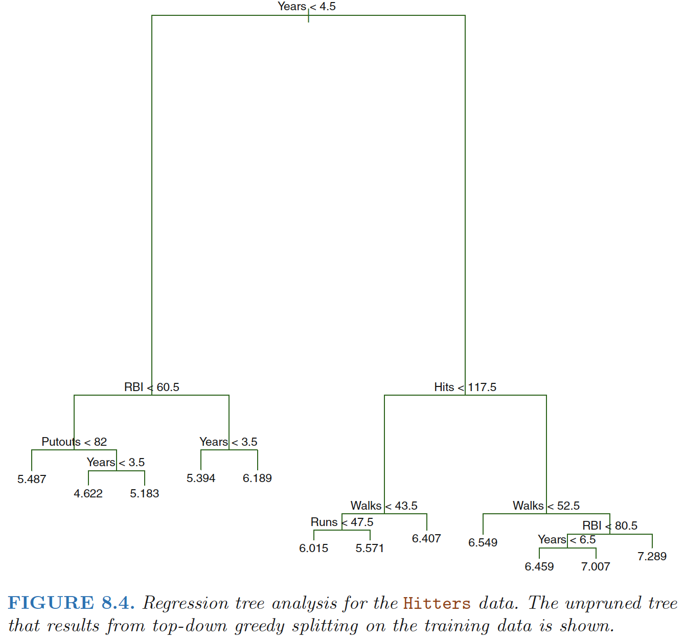
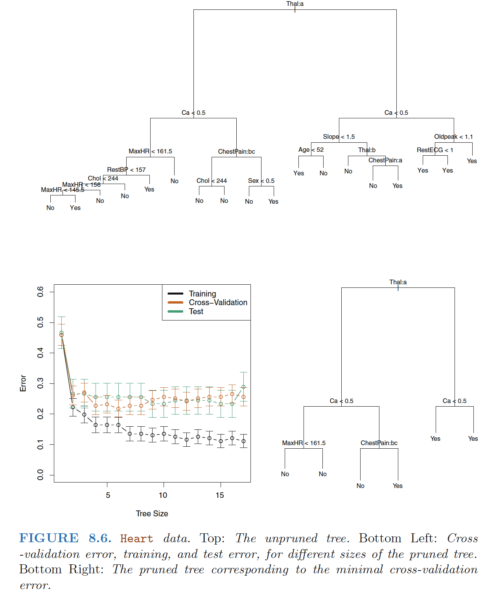
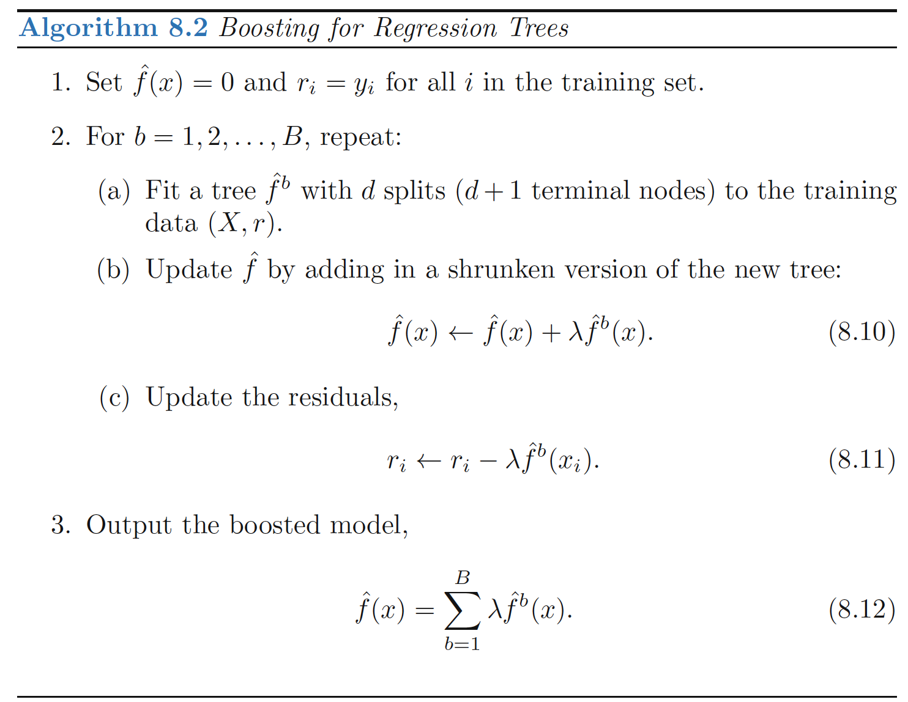

# Introduction to Descision Tree

## Regression Trees

### Predicting Baseball Players’ Salaries Using Regression Trees

**Terminal nodes**: The regions R1, R2, and R3 are known
as terminal nodes or leaves of the tree. 

**Internal nodes**: The points along the tree where the predictor space is split are referred to as internal nodes.

**Branches**: The segments of the trees that connect the nodes as branches

<!--more-->

### Prediction via Stratification of the Feature Space

**Process of building a regression tree**

**Step 1**: We divide the predictor space—that is, the set of possible values for
X1,X2, . . .,Xp—into J distinct and non-overlapping regions,
R1,R2, . . . , RJ .

**Step 2**: For every observation that falls into the region Rj, we make the same
prediction, which is simply the *mean of the response values* for the
training observations in Rj .

#### Step 1

**How do we construct the regions R1, . . .,RJ?** 

- We choose to divide the predictor space into high-dimensional rectangles, or
**boxes**, for ease of interpretation of the resulting predictive
model. 

- The goal is to find boxes R1, . . . , RJ that **minimize the RSS**,
  given by
  $$
  \begin{align}
  \sum_{j=1}^J\sum_{i \in R_j} (y_i-\hat{y}_{R_j})^2
  \end{align}
  $$

  where $\hat{y}_{R_j}$ is the mean response for the training observations within the
  jth box.

**Recursive Binary Splitting**: a *top-down, greedy* approach
- **Top-down**: begins at the top of the tree (at which point
all observations belong to a single region) and then successively splits the
predictor space; each split is indicated via two new branches further down
on the tree. 
- **Greedy**: at each step of the tree-building process,
the best split is made at that particular step, rather than looking ahead
and picking a split that will lead to a better tree in some future step.

**Methods**:
1. Select the predictor $X_j$ and the cutpoint $s$ such that splitting the predictor space into
the regions ${X|X_j < s}$ and ${X|X_j ≥ s}$ leads to the greatest possible
reduction in RSS
 - In greater detail, for any $j$ and $s$, we
    define the pair of half-planes
$$
  \begin{align}
  R_1(j, s) = {X|X_j < s} ,\quad R_2(j, s) = {X|X_j ≥ s}
  \end{align}
$$
  and we seek the value of $j$ and $s$ that **minimize** the equation
$$
  \begin{align}
  \sum_{:x_i \in R_1(j,s)}(y_i-\hat{y}_{R_1})^2+\sum_{:x_i \in R_2(j,s)}(y_i-\hat{y}_{R_2})^2
  \end{align}
$$
  where $\hat{y}_{R_1}$is the mean response for the training observations in $R_1(j, s)$,

  where $\hat{y}_{R_1}$is the mean response for the training observations in $R_1(j, s)$,

  and we seek the value of $j$ and $s$ that **minimize** the equation
$$
  \begin{align}
  \sum_{:x_i \in R_1(j,s)}(y_i-\hat{y}_{R_1})^2+\sum_{:x_i \in R_2(j,s)}(y_i-\hat{y}_{R_2})^2
  \end{align}
$$
  where $\hat{y}_{R_1}$is the mean response for the training observations in $R_1(j, s)$,

  where $\hat{y}_{R_1}$is the mean response for the training observations in $R_1(j, s)$,

2. Repeat the process, looking for the best predictor and best
cutpoint in order to split the data further so as to minimize the RSS within
each of the resulting regions. 
 - However, this time, instead of splitting the
entire predictor space, we split one of the two previously identified regions.

 - We now have three regions. Again, we look to split one of these three regions
further, so as to minimize the RSS. 

3. The process continues until a stopping
criterion is reached; for instance, we may continue until no region contains
more than five observations.

#### Step 2

Predict the response
for a given test observation using the mean of the training observations in
the region to which that test observation belongs.

### Tree Pruning

A better strategy is to grow a very large tree $T_0$, and then
**prune** it back in order to obtain a **subtree**

#### Cost complexity pruning
a.k.a.: **weakest link pruning**

Consider a sequence of trees indexed by a nonnegative tuning parameter α

For each value of α there corresponds a subtree $T ⊂ T_0$ such that

$$
\begin{align}
\sum_{m=1}^T\sum_{i:x_i \in R_m}(y_i − \hat{y}_{R_m})^2 + \alpha|T|  \quad \quad (8.4)
\end{align}
$$
is as small as possible. 

- $|T|$: the number of terminal nodes of the tree T , 
- $R_m$: the rectangle (i.e. the subset of predictor space) corresponding
to the m-th **terminal node**, 
- $\hat{y}_{R_m}$: the predicted response associated with $R_m$—that is, the mean of the training observations in $R_m$.

The tuning parameter $α$ controls a *trade-off* between the subtree’s **complexity**
and its **fit to the training data**. When α = 0, then the subtree T
will simply equal T0, because then (8.4) just measures the training error.
However, as α increases, there is a price to pay for having a tree with
many terminal nodes, and so the quantity (8.4) will tend to be minimized
for a smaller subtree. 

Equation 8.4 is reminiscent of the lasso, in which a similar formulation was used in order to control the
complexity of a linear model.

## Classification Trees
For a classification tree,
- We predict that
each observation belongs to the **most commonly occurring class** of training
observations in the region to which it belongs.
- RSS cannot be used as a criterion for making the binary splits $\Rightarrow$ **classification error rate**. 

### Classification Error Rate

- Since we plan to assign an observation in a given region to the most commonly occurring  class of training observations in that region, the classification error rate is
simply the **fraction of the training observations in that region that do not
belong to the most common class**:

$$
\begin{align}
E=1-\max_k(\hat{p}_{mk})
\end{align}
$$

- $\hat{p}_{mk}$ : the proportion of training observations in the mth
region that are from the kth class.
- classification
error is not sufficiently sensitive for tree-growing, and in practice two other
measures are preferable: **Gini index, cross-entropy.**

### Gini index
$$
\begin{align}
G=\sum_{k=1}^K\hat{p}_{mk}(1-\hat{p}_{mk})
\end{align}
$$

- A measure of total variance across the K classes. It is not hard to see
that the Gini index takes on a small value if all of the $\hat{p}_{mk}$’s are close to
zero or one.
- For this reason the Gini index is referred to as a measure of
node **purity**—a small value indicates that a node contains predominantly
observations from a single class.

### Cross-Entropy
$$
\begin{align}
D=-\sum_{k=1}^K\hat{p}_{mk}\log{\hat{p}_{mk}}
\end{align}
$$

- Since 0 ≤ $\hat{p}_{mk}$ ≤ 1, it follows that $0 ≤ −\hat{p}_{mk}\log{\hat{p}_{mk}}$. 
- Cross-entropy will take on a value near zero if the $\hat{p}_{mk}$’s are all near
zero or near one. Therefore, like the Gini index, the cross-entropy will take
on a small value if the mth node is **pure**. 

------

**Cross-Entropy v.s. Gini index v.s. Classification Error Rate**
- When building a classification tree, either the Gini index or the crossentropy
are typically used to evaluate the quality of a particular split,
since these two approaches are more sensitive to node purity than is the
classification error rate. Any of these three approaches might be used when
pruning the tree, but the classification error rate is preferable if prediction
accuracy of the final pruned tree is the goal.

- **A surprising characteristic**: some of the splits yield two
terminal nodes that have the same predicted value. 
 - **Why is the split performed at all?** The split is performed because it leads to **increased node purity.**
 - **Why is node purity important?** Suppose that we have a test observation
that belongs to the region given by that right-hand leaf. Then we
can be pretty certain that its response value is Yes. In contrast, if a test
observation belongs to the region given by the left-hand leaf, then its response
value is probably Yes, but we are much less certain. Even though
the split RestECG<1 does not reduce the classification error, it improves the
**Gini index and the cross-entropy**, which are more sensitive to node purity.

## Trees Versus Linear Models 

Linear regression assumes a model of the form
$$
\begin{align}
f(X)=\beta_0+\sum_{i=1}^p\beta_iX_i
\end{align}
$$
Regression trees assume a model of the form
$$
\begin{align}
f(X)=\sum_{m=1}^Mc_m \cdot I_{X \in R_m}
\end{align}
$$
where R1, . . .,RM represent a partition of feature space

where R1, . . .,RM represent a partition of feature space

**Linear regression works better**: If the
relationship between the features and the response is well approximated
by a linear model; regression
tree does not exploit this linear structure. 

**Regression tree works better**: If instead there is a highly
non-linear and complex relationship between the features and the response.

## Advantages and Disadvantages of Trees 

**Advantages of decision trees for regression and classification:**

▲ **Interpretation**: Trees are very **easy to explain** to people. In fact, they are even easier
to explain than linear regression!

▲ Some people believe that decision trees more closely **mirror human
decision-making** than do the regression and classification approaches.

▲ **Visualization**: Trees can be **displayed graphically**, and are easily interpreted even by
a non-expert.

▲ Trees can easily handle qualitative predictors without the need to
create dummy variables.

**Disadvantages of decision trees for regression and classification:**

▼ Unfortunately, trees generally do not have the same level of predictive
accuracy as some of the other regression and classification approaches
seen in this book.

# Bagging 

**Bootstrap aggregation**, or **bagging**, is a general-purpose procedure for reducing the
variance of a statistical learning method, frequently used in the context of decision trees.

**Averaging a set of observations reduces variance**: Recall that given a set of n independent observations Z1, . . . , Zn, each
with variance $σ^2$, the variance of the mean $\bar{Z}$ of the observations is given
by $σ^2/n$. 

- A natural way to reduce the variance and hence increase the prediction
  accuracy of a statistical learning method is to **take many training sets
  from the population**, build a separate prediction model using each training
  set, and average the resulting predictions.

**Bootstrap** taking repeated samples from the (single) training data set 

**Bagging**

- Generate B different bootstrapped training data sets. 
- Train our method on
  the bth bootstrapped training set in order to get $\hat{f}^{*b}(x)$
- Finally average
  all the predictions, to obtain

$$
\begin{align}
\hat{f}_{bag}(x)=\frac{1}{B}\sum_{b=1}^B\hat{f}^{*b}(x)
\end{align}
$$

**Apply bagging to regression trees**

- Construct B regression trees using B bootstrapped training
  sets
- Average the resulting predictions. These trees are grown deep,
  and are not pruned. Hence each individual tree has high variance, but
  low bias. Averaging these B trees reduces the variance. 

**Bagging on Classification Tree**

- For a given test observation, we can record the class predicted by each of the B trees, and
  take a **majority vote**: the overall prediction is the most commonly occurring
  class among the B predictions.

**B**

- In practice weuse a value of B sufficiently large that the error has settled down, like B=100.

## Out-of-Bag Error Estimation 

Recall that the key to bagging is that trees are
repeatedly fit to bootstrapped subsets of the observations. One can show
that on average, each bagged tree makes use of around 2/3 of the
observations. The remaining one-third of the observations not used to fit a
given bagged tree are referred to as the **out-of-bag (OOB)** observations. 

> We can predict the response for the ith observation using each of the trees inwhich that observation was OOB. 

- This will yield around B/3 predictions for the ith observation. 
- To obtain a single prediction for the ith observation, we can **average** these predicted responses (regression) or can take a **majority vote** (classification). 
- This leads to a single OOB prediction for the ith observation.

The OOB approach for estimating
the test error is particularly convenient when performing bagging on large
data sets for which **cross-validation** would be computationally onerous.

## Variable Importance Measures 

**Bagging improves prediction accuracy at the expense of interpretability**

- When we bag a large number of trees, it is no longer possible to represent the resulting statistical learning procedure using a single tree, and it is no longer clear which variables are most important to the procedure

**Variable Importance**

- One can obtain an overall summary of the importance of
  each predictor using the RSS (for bagging regression trees) or the Gini index
  (for bagging classification trees). 

- **Bagging regression trees**: Record the total amount that the RSS is decreased due to splits
  over a given predictor, averaged over all B trees. A large value indicates
  an important predictor. 
  $$
  \begin{align}
  RSS=\sum_{j=1}^J\sum_{i \in R_j} (y_i-\hat{y}_{R_j})^2
  \end{align}
  $$
  
- **Bagging classification
  trees**: Add up the total amount that the **Gini index** is decreased
  by splits over a given predictor, averaged over all B trees.

# Random Forest

**Random forests** provide an improvement over bagged trees by way of a small tweak that **decorrelates** the trees. 

As in bagging, we build a number  of decision trees on bootstrapped training samples. But when building these decision trees, each time a split in a tree is considered, *a random sample of m predictors is chosen as split candidates* from the full set of p predictors.

**The split is allowed to use only one of those m predictors.** A fresh sample of m predictors is taken at each split, and typically we choose $m ≈\sqrt{p}$ 

**Rationale**:

- Suppose that there is one very strong predictor in the data set, along with a number of other moderately strong predictors. Then in the collection of bagged trees, most or all of the trees will use this strong predictor in the top split. Consequently, *all of the bagged trees will look quite similar to each other.*
- Hence the predictions from the bagged trees will be highly correlated. Unfortunately, averaging many highly correlated quantities does not lead to as large of a reduction in variance as averaging many uncorrelated quantities.

**Decorrelating** the trees: Random forests forces each split to consider only a subset of the predictors, making the average of the resulting trees less variable and hence more reliable.

# Boosting

**Boosting**: another approach for improving the predictions resulting from a decision tree.

- Trees are grown **sequentially**: each tree is grown using information from previously
  grown trees. 
- Boosting does not involve bootstrap sampling; instead each
  tree is fit on a modified version of the original data set.

**Idea behind this procedure**

- Unlike fitting a single large decision tree to the data, which amounts to fitting the data hard and potentially overfitting, the boosting approach instead **learns slowly**. 
- Given the current model, we fit a decision tree to the residuals from the model. That is, we fit a tree using the current residuals, rather than the outcome Y , as the response.
- We then add this new decision tree into the fitted function in order to update the residuals. Each of these trees can be rather small, with just a few terminal nodes, determined by the parameter **d** in the algorithm. 
- By fitting small trees to the residuals, we slowly improve $\hat{f}$ in areas where it does not perform well. 
- The shrinkage parameter **λ** slows the process down even further, allowing more and different shaped trees to attack the residuals.

> Note that in boosting, unlike in bagging, the construction of each tree depends strongly on the trees that have already been grown.

**Boosting has three tuning parameters:**

1. The number of trees $B$.
2. The shrinkage parameter $λ$, a small positive number. This controls the rate at which boosting learns.
3. The number $d$ of splits in each tree, which controls the complexity of the boosted ensemble. Often d = 1 works well, in which case each tree is a **stump**, consisting of a single split. In this case, the boosted ensemble is fitting an **additive model**, since each term involves only a single variable. More generally $d$ is the **interaction depth**, and controls the interaction order of the boosted model, since $d$ splits can involve  at most d variables.

**Boosting V.S. Random forests:**

- In boosting, because the growth of a particular tree takes into account the other trees that have already been grown, smaller trees are typically sufficient. 
- Using smaller trees can aid in interpretability as well; for instance, using **stumps** leads to an additive model.

------

**Ref:**

James, Gareth, et al. *An introduction to statistical learning*. Vol. 112. New York: springer, 2013.

Hastie, Trevor, et al. "The elements of statistical learning: data mining, inference and prediction." *The Mathematical Intelligencer* 27.2 (2005): 83-85