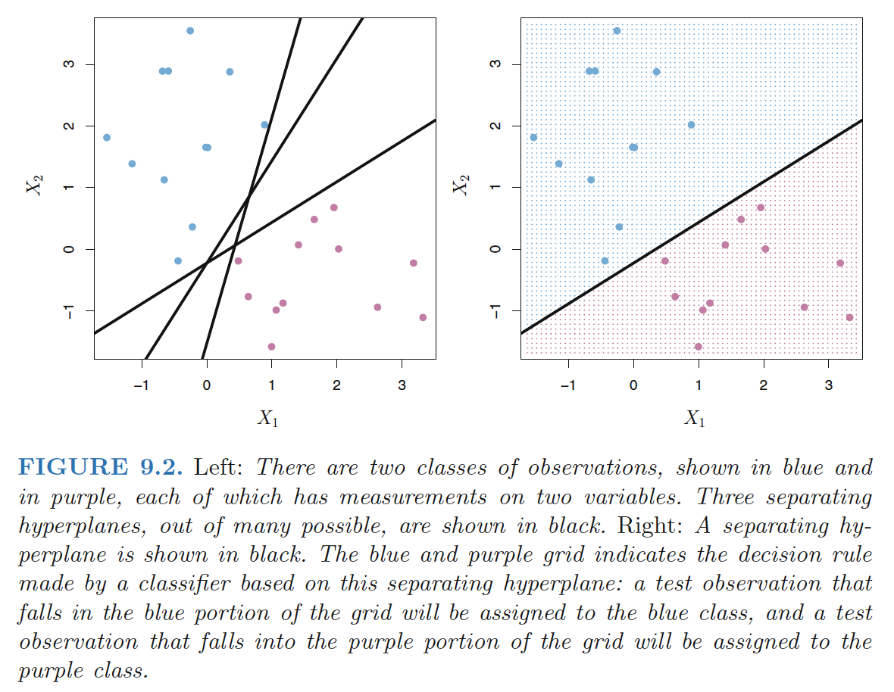
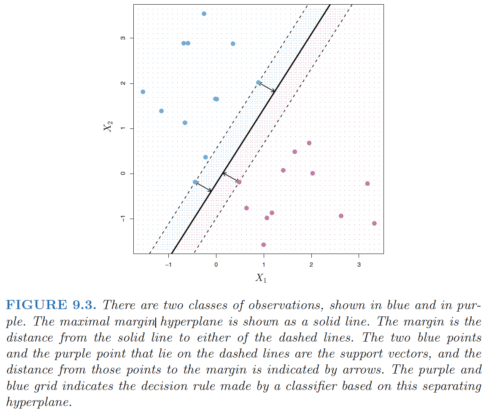
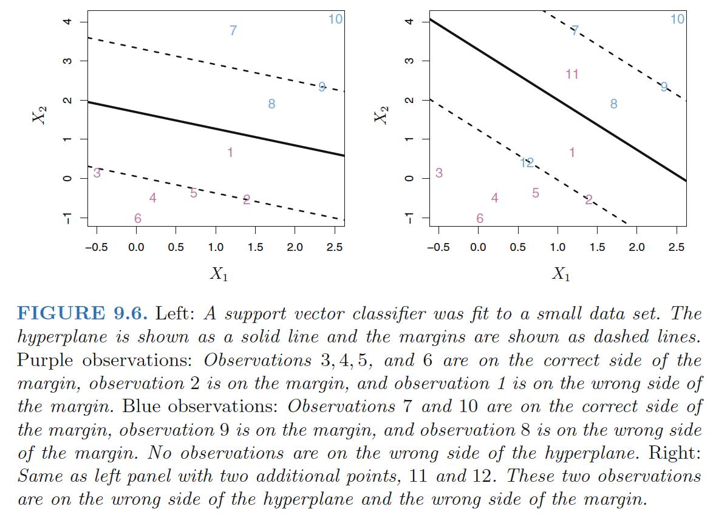
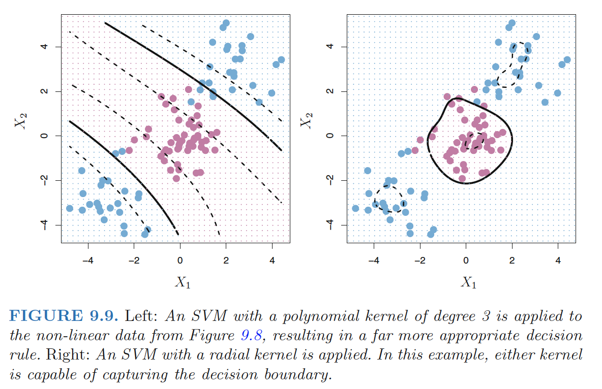
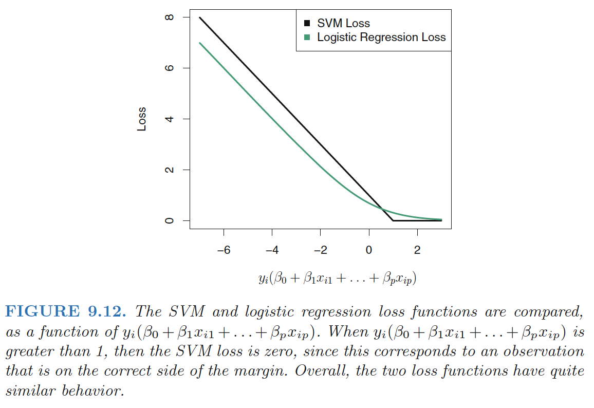

# Maximal Margin Classifier

## What Is a Hyperplane?

**Hyperplane**: In a p-dimensional space, a hyperplane is a flat affine subspace of dimension $p − 1$.

- e.g. in two dimensions, a hyperplane is a flat one-dimensional subspace—in other words, a line.

**Mathematical definition of a hyperplane**:
$$
\beta_0+\beta_1X_1+\beta_2X_2,...+\beta_pX_p=0, \quad (9.1)
$$

- Any $X = (X_1,X_2,…X_p)^T$ for which (9.1) holds is a point on the hyperplane.

<!--more-->

## Classification Using a Separating Hyperplane

**Setting**:

- $n \times p$ data matrix $X$ that consists of $n$ training observations in p-dimensional space
- These observations fall into two classes—that is, $y_1, . . . , y_n \in \{−1, 1\} $.
- Test observation: a p-vector of observed features $x^∗ =\{x^∗_1 . . . x^∗_p\}^T$.

**Separating hyperplane** has the property that:
$$
y_i(\beta_0+\beta_1x_{i1}+\beta_2x_{i2},...+\beta_px_{ip})>0, \quad (9.8)
$$

- for all i=1,…,n

We classify the test observation $x^*$ based on the sign of $f(x^∗) = \beta_0+\beta_1x_{1}^*+\beta_2x_{2}^*,...+\beta_px_{p}^*$. 

- If $f(x^∗)$ is positive, then we assign the test observation to class 1, and if f(x∗) is negative, then we assign it to class −1.
- **Magnitude** of $f(x^∗)$. If $f(x^∗)$is far from zero, then this means that $x^∗$ lies far from the hyperplane,and so we can be confident about our class assignment for $x^∗$.

## The Maximal Margin Classifier

***Margin***: the smallest (perpendicular) distance from each training observation to a given separating hyperplane $\Rightarrow$  the minimal distance from the observations to the hyperplane.

***Maximal margin hyperplane***: the separating hyperplane that is farthest from the training observations.

- The maximal margin hyperplane is the separating hyperplane for which the *margin* is **largest**
- Overfitting when $p$ is large.

***Maximal margin classifier***: classify a test observation based on which side of the maximal margin hyperplane it lies. 

***Support vectors***: training observations that are equidistant from the maximal margin hyperplane that indicate *the width of the margin*.

- They “support” the maximal margin hyperplane in the sense vector that if these points were moved slightly then the maximal margin hyperplanewould move as well.
- *The maximal margin hyperplane depends directly on the support vectors, but not on the other observations*

## Construction of the Maximal Margin Classifier

The maximal margin hyperplane is the solution to the optimization problem
$$
\max_{\beta_0,...\beta_p} M \\
s.t.  \sum_{j=1}^p \beta_j^2=1,  \quad (9.10) \\
 y_i(\beta_0+\beta_1x_{i1}+\beta_2x_{i2},...+\beta_px_{ip})>M \quad \forall i=1,..,n.  \quad (9.11)
$$

- The constraint in (9.11) in fact requires that each observation be on the correct side of the hyperplane, with some cushion, provided that **margin** $M$ is positive.)
- The constraint  in (9.10) makes sure the perpendicular distance from the i-th observation to the hyperplane is given by

$$
y_i(\beta_0+\beta_1x_{i1}+\beta_2x_{i2},...+\beta_px_{ip})
$$

# Support Vector Classifiers

## Overview of the Support Vector Classifier

**Maximal margin hyperplane** is extremely sensitive to a change in a single observation suggests that it may have ***overfit*** the training data.

In this case, we might be willing to consider a classifier based on a hyperplane that does not perfectly separate the two classes, in the interest of

- Greater *robustness* to individual observations, and
- Better classification of most of the training observations.

***Support Vector Classifier (Soft Margin Classifier)***: Rather than seeking the largest possible margin  that every observation is not only on the correct side of the hyperplane but also on the correct side of the margin, we instead allow some observationsto be on the incorrect side of the margin, or even the incorrect side of the hyperplane.

## Details of the Support Vector Classifier

**Optimization problem**:
$$
\max_{\beta_0,...\beta_p,\epsilon_1,..,\epsilon_n} M \\
s.t.  \sum_{j=1}^p \beta_j^2=1,  \quad (9.13) \\
 y_i(\beta_0+\beta_1x_{i1}+\beta_2x_{i2},...+\beta_px_{ip})>M(1-\epsilon_i) \quad \forall i=1,..,n.  \quad (9.14) \\
 \epsilon_i\geq0,\sum_{i=1}^p\epsilon_i \leq C, \quad (9.15)
$$

- ***Slack variables***: $\epsilon_1,..,\epsilon_n$ - allow individual observations to be on the wrong side of the margin or the hyperplane
  - $\epsilon_i=0$: the i-th observation is on the correct side of the *margin*
  - $\epsilon_i >0$: the i-th observation is on the wrong side of the *margin* $\Rightarrow$ i-th observation ***violated*** the margin.
  - $\epsilon_i >1$: the i-th observation is on the wrong side of the *hyperplane*
- Classify the test observation based on the sign of $f(x^∗) = \beta_0+\beta_1x_{1}^*+\beta_2x_{2}^*,...+\beta_px_{p}^*$.
- ***Tuning parameter C***: $C$ bounds the sum of the $\epsilon_i$'s, and so it determines the number and severity of the violationsto the margin(and to the hyperplane) that we will tolerate. $
  - ***budget*** for the amount that the margin can be violated by the $n$ observations.
  - Generally chosen via *cross-validation*.
  - $C$ controls the **bias-variance trade-off** of the support vector classifier.
    - C is small: a classifier highly fit to the data, fewersupport vectors $\Rightarrow$  low bias , high variance;
    - C is large: margin wider, many support vectors $\Rightarrow$  high bias , low variance;

**Properties**:

- Only observations that either *lie on the margin or that violate the margin* (**support vectors**) will affect the hyperplane, and hence the classifier obtained.
- The fact that the support vector classifier’s decision rule is based only on a potentially small subset of the training observations (the ***support vectors***) means that it is quite **robust** to the behavior of observations that are far away from the hyperplane.
  - Different from LDA which depends on the mean of *all* of the observations within each class, as well as the *within-class covariance matrix* computed using all of the observations

# Support Vector Machines

## SVMs with Kernel 

The ***support vector machine (SVM)*** is an extension of the support vector classifier that results from enlarging the feature space using **kernels**.

The ***solution to the support vector classifier problem*** involves only the ***inner products*** of the observations:
$$
\langle x_i,x_{i^{'}} \rangle =\sum_{j=1}^px_{ij}x_{i^{'}j}
$$
(Details won't be discussed in this note)

The **linear support vector classifier** can be represented as
$$
f(x)=\beta_0+\sum_{i=1}^n \alpha_i \langle x,x_i \rangle
$$

- $α_i$ is nonzero only for the support vectors in the solution—that is, if a training observation is not a support vector, then its $α_i$equals zero.

So if $S$ is the collection of indices of these support points:
$$
f(x)=\beta_0+\sum_{i \in S}^n \alpha_i \langle x,x_i \rangle
$$
**Generalization**: *Kernel*
$$
K(x_i,x_{i^{'}})
$$
**Kernel**:  Kernel is a function that quantifies the similarity of two observations. 

- ***Linear kernel***: $K(x_i,x_{i^{'}})=\sum_{j=1}^px_{ij}x_{i^{'}j}$ 
  - Linear kernel essentially quantifies the similarity of a pair of observations using **Pearson** (standard) correlation.
- ***Polynomial kernel*** of degree d: $K(x_i,x_{i^{'}})=(1+\sum_{j=1}^px_{ij}x_{i^{'}j})^d$
  - fitting a support vector classifier in a higher-dimensional space involving polynomials of degree $d$. 
- ***Radial kernel***: $K(x_i,x_{i^{'}})=\exp(-\gamma \sum_{j=1}^p(x_{ij}-x_{i^{'}j})^2)$  
  - Radial kernel has very *local* behavior: only nearby training observations have an effect on the class label of a test observation
    - If a given test observation $x^∗ = (x^∗_1 . . .x^∗_p)^T$ is far from a training observation $x_i$ in terms of ***Euclidean distance***; $\Rightarrow$  $ \sum_{j=1}^p(x_{ij}-x_{i^{'}j})^2 $ will be large $\Rightarrow$ $K(x_i,x_{i^{'}})=\exp(-\gamma \sum_{j=1}^p(x_{ij}-x_{i^{'}j})^2)$  will be very tiny. $\Rightarrow$ $x_i$ will play virtually no role in $f(x^∗)$.

***Support Vector Machine***: When the support vector classifieris combined with a non-linear kernel, the resulting classifier is known as a support vector machine.
$$
f(x)=\beta_0+\sum_{i \in S}^n \alpha_i K(x,x_i)
$$

**Advantage of Kernel over enlarging the feature space using functions of the original features: **

- ***Computational***: one need only compute $K(x_i,x_{i^{'}})$ for all $\left(\begin{array}{c}n\\ 2\end{array}\right)$ distinct pairs $i, i^{'}$. This can bedone without explicitly working in the *enlarged feature space.* 
  - **Curse of dimensionality**: for some kernels, such as the radial kernel,  the feature space is implicit and infinite-dimensional.

## SVMs with More than Two Classes

### One-Versus-One Classification

A ***one-versus-one*** or ***all-pairs*** approach constructs $\left(\begin{array}{c}K\\ 2\end{array}\right)$ SVMs, each of which compares a pair of classes

1. One such SVM might compare the $k$-th class, coded as +1, to the $k^{'}$-th class, codedas −1. 
2. We classify a test observation using each of the $\left(\begin{array}{c}K\\ 2\end{array}\right)$ classifiers.
3. We tally the number of times that the test observation is assigned to each of the K classes. 
4. The final classification is performed by assigning the test observation to the class to which it  was most frequently assigned in these $\left(\begin{array}{c}K\\ 2\end{array}\right)$ pairwise classifications.

### One-Versus-All Classification

The ***one-versus-all*** approach:

1. We fit $K$ SVMs, each time comparing one of all the K classes to the remaining K − 1 classes. 
2. Let $β_{0k}, β_{1k}, . . . , β_{pk}$  denote the parameters that result from fitting an SVM comparing the kth class(coded as +1) to the others (coded as −1). 
3. Let $ x^∗$ denote a test observation. We assign the observation to the class for which $β_{0k}x_1^*+β_{1k}x_2^*+, . . . ,+ β_{pk}x_p^*$  is largest, as this amounts to a high level of confidence that the test observation belongs to the kth class rather than to any of the other classes.

## Relationship to Logistic Regression

Rewrite the criterion (9.12)–(9.15) [look at last post] for fitting the support vector classifier $f(X) = β_0 + β_1X_1 + . . . + β_pX_p$ as 
$$
\min_{\beta_0,...,\beta_p}\left\{ \sum_{i=1}^n\max[0,1-y_If(x_i)]+\lambda\sum_{j=1}^p\beta_j^2 \right\}
$$

- λ is small: few violations to the margin ; high-variance, low-bias; $\Leftrightarrow$ small $C$;

**“Loss + Penalty” form**:
$$
\min_{\beta_0,...,\beta_p}\left\{ L(\mathbf{X},\mathbf{y},\beta)+\lambda P(\beta) \right\}
$$

- $L(\mathbf{X},\mathbf{y},\beta)$ : loss function
- $P(\beta)$: penalty function

**Ridge regression and the lasso**:
$$
L(\mathbf{X},\mathbf{y},\beta)=\sum_{i=1}^n \left( y_i-\beta_0-\sum_{j=1}^p x_{ij}\beta_j \right)^2 \\
P(\beta) = \sum_{j=1}^p \beta_j^2 \quad ridge \, regression \\
P(\beta) = \sum_{j=1}^p |\beta_j| \quad lasso
$$
**SVM**:  ***hindge loss***
$$
L(\mathbf{X},\mathbf{y},\beta)=\sum_{i=1}^n \max[0,1-y_i(\beta_0+\beta_1x_{i1}+,,,+\beta_px_{ip})]
$$

- Due to thesimilarities between their loss functions, logistic regression and the supportvector classifier often give very similar results. 
- When the classes are well separated, SVMs tend to behave better than logistic regression

------

**Ref:**

James, Gareth, et al. *An introduction to statistical learning*. Vol. 112. New York: springer, 2013.

Hastie, Trevor, et al. "The elements of statistical learning: data mining, inference and prediction." *The Mathematical Intelligencer* 27.2 (2005): 83-85