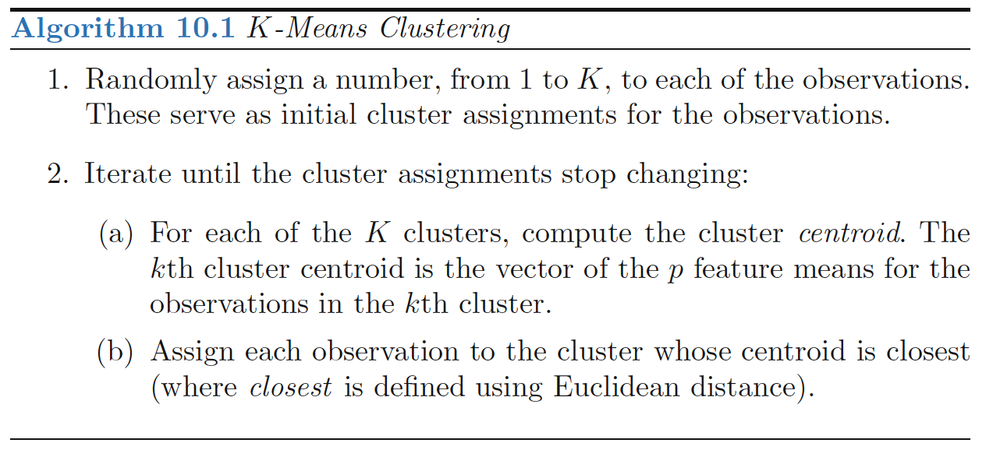
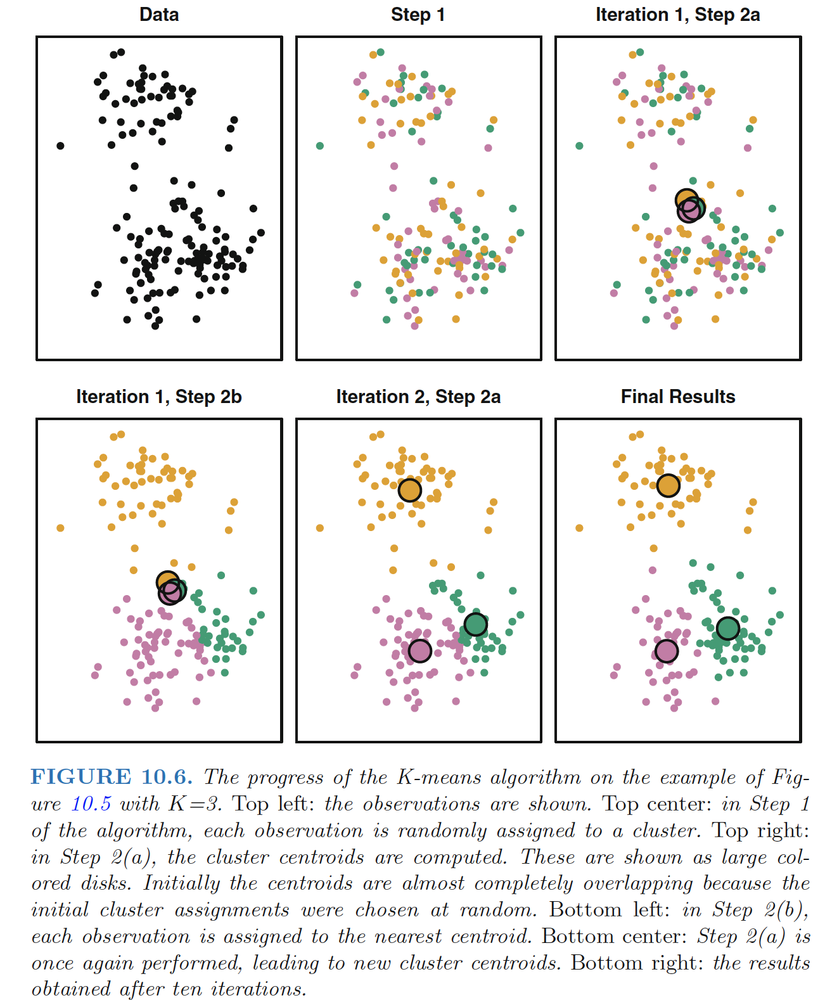
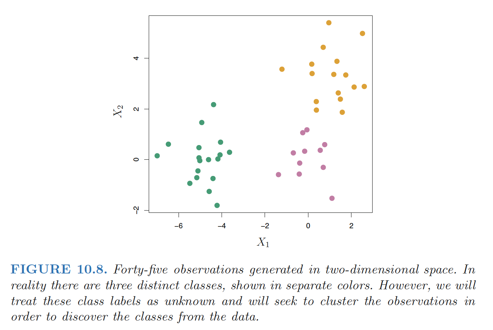
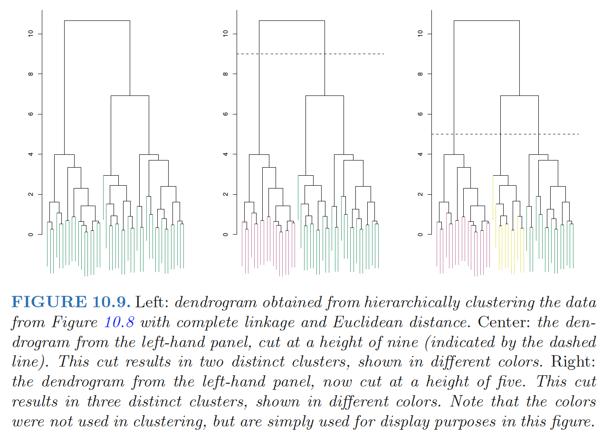
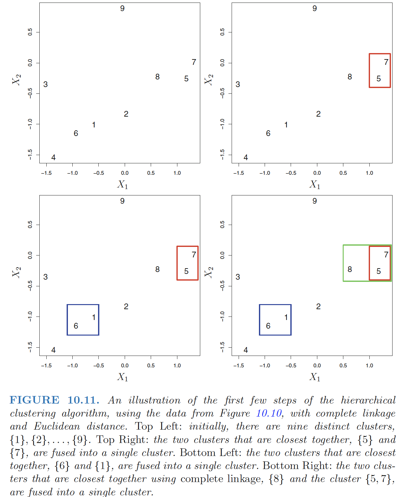
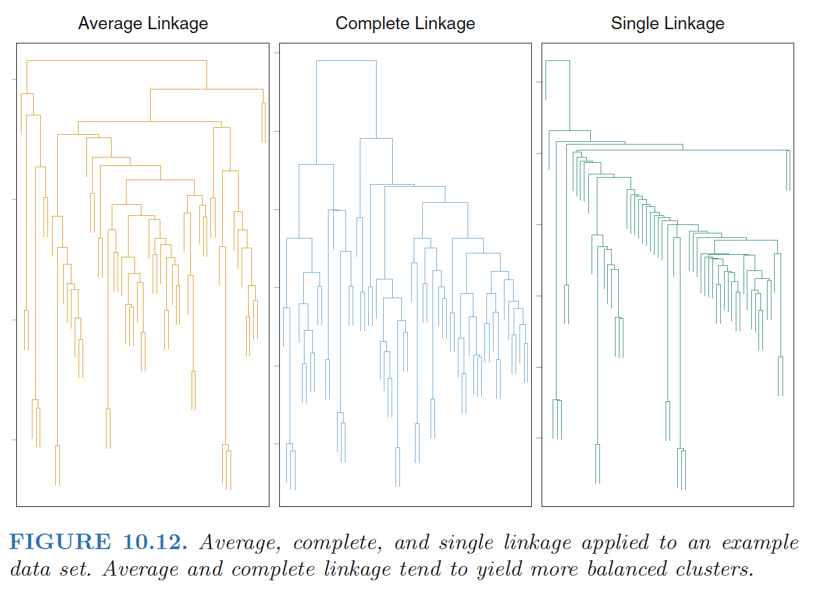

# Clustering Methods

**Clustering** refers to a very broad set of techniques for finding subgroups, or clusters, in a data set. 

- When we cluster the observations of a data set, we seek to partition them into distinct groups so that the observations within each group are quite similar to each other

- This is an unsupervised problem because we are trying to discover structure

<!--more-->

## Clustering v.s. PCA

Both clustering and PCA seek to simplify the data via a small number of summaries, but their mechanisms are different:

- PCA looks to find a low-dimensional representation of the observations that explain a good fraction of the variance;

- Clustering looks to find homogeneous subgroups among the observations.

**Application:market segmentation**

# K-Means Clustering

**K-means clustering** is a simple and elegant approach for partitioning a data set into K distinct, ***non-overlapping*** clusters. 

The idea behind **K-means clustering** is that a *good* clustering is one for which the ***within-cluster*** ***variation*** is as small as possible.

The **within-cluster variation** for cluster $C_k$ is a measure $W(C_k)$ of the amount by which the observations within a cluster differ from each other.

Hence we want to solve the problem,
$$
\min_{C_1,...,C_K}\left\{ \sum_{i=1}^KW(C_k) \right\}
$$

- partition the observations into K clusters such that the total within-cluster variation, summed over all K clusters, is *as small as possible*.

**Define the within-cluster variation**: ***Euclidean distance***:
$$
W(C_k)=\frac{1}{|C_k|}\sum_{i,i^{'}\in C_k}\sum_{j=1}^p(x_{ij}-x_{i^{'}j})^2
$$

- where $|C_k|$ denotes the number of observations in the kth cluster.
- The within-cluster variation for the kth cluster is *the sum of all ofthe pairwise squared Euclidean distances between the observations in the kth cluste*r, divided by the total number of observations in the kth cluster.

## K-means Clustering Optimization Problem

**Objective funtion**:
$$
\min_{C_1,...,C_K}\left\{ \sum_{i=1}^K\frac{1}{|C_k|}\sum_{i,i^{'}\in C_k}\sum_{j=1}^p(x_{ij}-x_{i^{'}j})^2\right\}
$$

Algorithm 10.1 is guaranteed to decrease the value of the objective at each step:
$$
\frac{1}{|C_k|}\sum_{i,i^{'}\in C_k}\sum_{j=1}^p(x_{ij}-x_{i^{'}j})^2=2\sum_{i\in C_k}\sum_{j=1}^p(x_{ij}-\bar{x}_{kj})^2, \quad (10.12)
$$

- where $\bar{x}_{kj}=\frac{1}{C_k}\sum_{i \in C_k}x_{ij}$  is the mean for feature $j$ in cluster $C_k$.

**Step 2(a)** : the *cluster means* for each feature are the constants that minimize the sum-of-squared deviations

**Step 2(b)** : reallocating the observations can only improve (10.12). 

**Local optimum** : This means that as the algorithmis run, the clustering obtained will continually improve until the result no longer changes; the objective  will never increase.

- It is important to run the algorithm multiple times from different random initial configurations, because the results obtained will depend on the initial (random) cluster assignmentof each observation in Step 1 of Algorithm 10.1

# Hierarchical Clustering

**Hierarchical clustering** is an alternative approach which does not require that we commit to a particular choice of $K$. 

- Added advantage over K-means clustering in that it results in an attractive tree-based representation of the observations, called a ***dendrogram***.

**Bottom-up** or **agglomerative** clustering: the most common type of hierarchical clustering.

## Interpreting a Dendrogram

In the left-hand panel of Figure 10.9, each *leaf* of the dendrogram representsone of the 45 observations in Figure 10.8. 

- As we move up the tree, some leaves begin to **fuse** into branches: observations that are similar to each other. 

- The earlier(lower in the tree) fusions occur, the more similar the groups of observationsare to each other. 
- For any two observations, we can look for the point in the tree where branches containing those two observations are first fused.
  - The *height* of this fusion, as measured on the vertical axis, indicates how different the two observations are.

Thus, observations that fuse at the very bottom of the tree are quite similar to each other, whereas observationsthat fuse close to the top of the tree will tend to be quite different.

**Identifying clusters on the basisof a dendrogram**:

Make a *horizontal cut* across the dendrogram, as shown in the center and right-hand panels of Figure 10.9. The distinct sets of observations beneath the cut can be interpreted as clusters.

>  ***The height of the cut to the dendrogram serves the same role as the K in K-means clustering: it controls the number ofclusters obtained.***

***Hierarchical*** refers to the fact that clusters obtained by cutting the dendrogram at a given height are necessarily *nested* within the clusters obtained by cutting the *dendrogram* at any greater height.

**Disadvantage**: hierarchical clustering can sometimes yield worse results than *K-means clustering* when the assumption of hierarchical structure unrealistic.

## The Hierarchical Clustering Algorithm

**Explanation:**

The two clusters that are most similar to each other are then fused so that there now are n−1 clusters. Next the two clusters that are most similar to each other arefused again, so that there now are n − 2 clusters. The algorithm proceeds in this fashion until all of the observations belong to one single cluster, and the dendrogram is complete.

> How did we determine that the cluster {5, 7} should be fused with the cluster {8}? - linkage

**Linkage** : defines the *dissimilarity* between two groups of observations.

- Complete, average, single, and centroid
- The dissimilarities computed in Step 2(b)of the hierarchical clustering algorithm will depend on the type of linkage used, as well as on the choice of dissimilarity measure.

## Choice of Dissimilarity Measure

**Dissimilarity Measure**:

- ***Euclidean distance***
- ***Correlation-based distance***: considers two observationsto be similar if their features are highly correlated

In general, careful attention should be paid to the *type* of data being clustered and the scientific question at hand which determines what type of dissimilarity measureis used for hierarchical clustering.

**Note:** variables should be ***scaled*** to have standarddeviation one before the dissimilarity between the observations iscomputed.

# Practical Issues in Clustering

## Small Decisions with Big Consequences

In order to perform clustering, some decisions must be made.

- Should the observations or features first be standardized to have mean zero and scaled to have standard deviation one.
- In the case of hierarchical clustering,
  - What dissimilarity measure should be used?
  - What type of linkage should be used?
  - Where should we cut the dendrogramin order to obtain clusters?
- In the case of K-means clustering, how many clusters should we lookfor in the data?\\

We try several different choices, and look for the one withthe most useful or interpretable solution.

------

**Ref:**

James, Gareth, et al. *An introduction to statistical learning*. Vol. 112. New York: springer, 2013.

Hastie, Trevor, et al. "The elements of statistical learning: data mining, inference and prediction." *The Mathematical Intelligencer* 27.2 (2005): 83-85