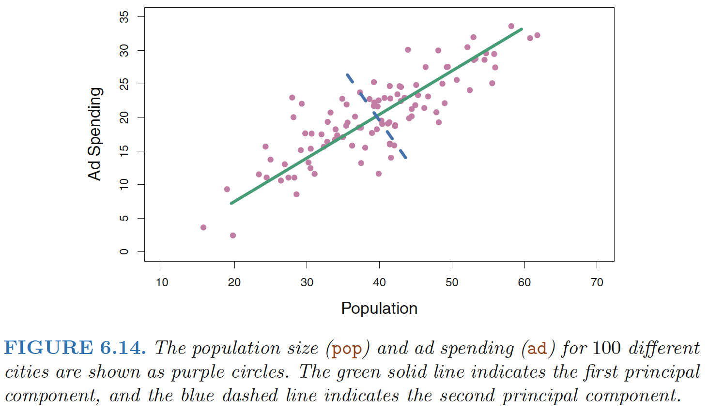
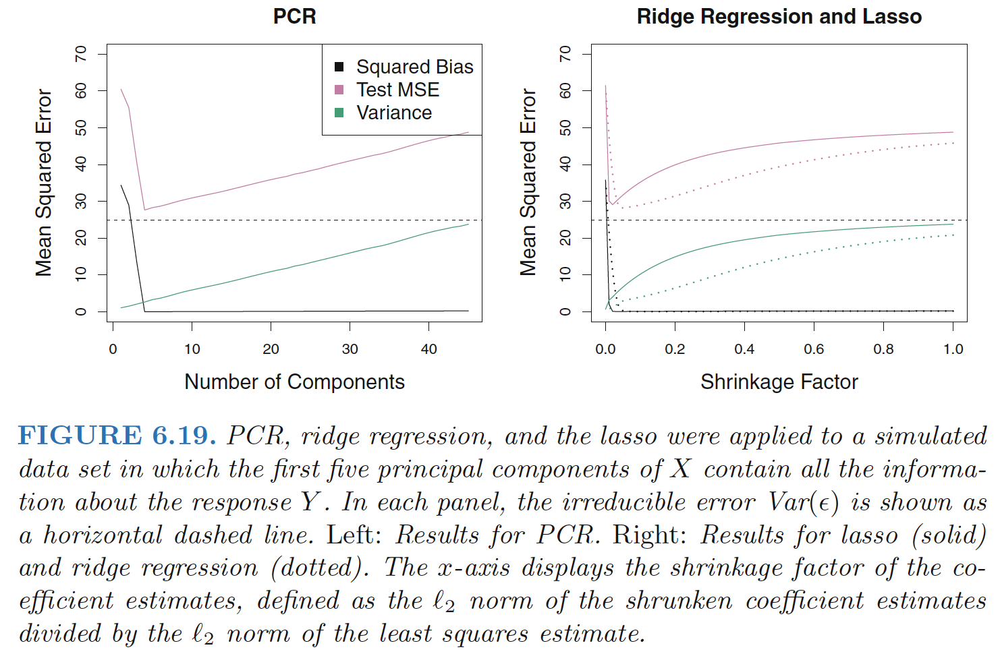
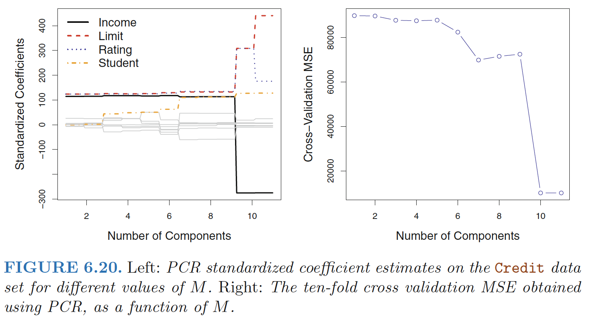

# Dimension Reduction Methods

Subset selection and shrinkage methods all use the original predictors, X1,X2, . . . , Xp. 

Dimension Reduction Methods ***transform*** the predictors and then fit a least
squares model using the transformed variables.

## Approach
Let $Z_1,Z_2, . . . ,Z_M$ represent $M < p$ linear combinations of our original $p$ predictors. That is,

$$
\begin{align}
Z_m=\sum_{j=1}^p\phi_{jm}X_j
\end{align}
$$
<!--more-->

for some constants $φ_{1m}, φ_{2m} . . . , φ_{pm}, m = 1, . . .,M.$ We can then fit the
linear regression model
$$
\begin{align}
y_i=\theta_0+\sum_{m=1}^M\theta_m z_{im}+\epsilon_i  \quad  i=1,2,3,4,...,n
\end{align}
$$
**Dimension reduction**: reduces the problem of estimating the $p+1$ coefficients $β_0, β_1, . . . , β_p$ to the
simpler problem of estimating the $M + 1$ coefficients $θ_0, θ_1, . . . , θ_M$, where
M < p. In other words, the dimension of the problem has been reduced
from $p + 1$ to $M + 1$.
$$
\begin{align}
\sum_{m=1}^M\theta_m z_{im}&=\sum_{m=1}^M\theta_m \sum_{j=1}^p\phi_{jm}x_{ij}=\sum_{m=1}^M\sum_{j=1}^p\theta_m \phi_{jm}x_{ij}=\sum_{j=1}^p \beta_jx_{ij}  \\
\beta_j&=\sum_{m=1}^M\theta_m \phi_{jm}
\end{align}
$$
**All dimension reduction methods work in two steps:**

1. The transformed predictors $Z_1,Z_2, . . . ,Z_M$are obtained.
2. The model is fit using these $M$ predictors. However, the choice of $Z_1,Z_2, . . . ,Z_M$, or equivalently,
the selection of the $φ_{jm}$’s, can be achieved in different ways. 

# Principal Components Regression 

## An Overview of Principal Components Analysis

**Principal component analysis (PCA)** refers to the process by which principal components are computed, and the subsequent use of these components in understanding the data.

- PCA also serves as a tool for data visualization (visualization of
  the observations or visualization of the variables).

## What Are Principal Components?

**PCA** :finds a low-dimensional representation of a data set that contains as much as possible of the **variation**

Each of the dimensions found by PCA is a linear combination of the $p$ features. 

***The first principal component*** of a set of features $X_1,X_2, . . . , X_p$ is the normalized linear combination of the features
$$
\begin{align}
Z_1=\phi_{11}X_1+\phi_{21}X_2+,,,+\phi_{p1}X_p
\end{align}
$$
 that has the **largest variance**. 

**Normalized**: $\sum_{j=1}^p \phi_{j1}^2=1$

**Loadings**: $\phi_{11}, . . . , \phi_{p1}$ the loadings of the first principal component; 

- Together, the loadings make up the principal component loading vector, $\phi_1=(\phi_{11},\phi_{21},...,\phi_{p1})^T$

### 1st Principal Component

#### Interpretation 1: greatest variability

**The first principal component** direction of the data: is that along which the observations **vary the most**.

The first principal component direction is the direction along which there is the greatest variability in the data. That is, if we projected the 100 observations onto this line (as shown in the left-hand panel of Figure 6.15), then the resulting projected observations would have the largest possible variance

The first principal component is given by the formula

$$
\begin{align}
Z_1 = 0.839 × (pop − \bar{pop}) + 0.544 × (ad − \bar{ad})
\end{align}
$$
Here $φ_{11} = 0.839$ and $φ_{21} = 0.544$ are the **principal component loadings**,
which define the direction referred to above.

>The idea is that out of every possible linear combination
of pop and ad such that $\phi_{11}^2+\phi_{21}^2=1$, this particular linear combination
yields the highest variance: i.e. this is the linear combination for which
$Var(φ_{11} × (pop − \bar{pop}) + φ_{21} × (ad − \bar{ad}))$ is maximized.

**Principal Component Scores**

The values of $z_{11}, . . . , z_{n1}$ are known as the **principal component scores**, and
can be seen in the right-hand panel of Figure 6.15. For example,
$$
\begin{align}
z_{i1} = 0.839 × (pop_i − \bar{pop}) + 0.544 × (ad_i − \bar{ad})
\end{align}
$$

#### Interpretation 2: closest to data

There is also another interpretation for PCA: the first principal component
vector defines the line that is as close as possible to the data. 

In Figure 6.14, the first principal component line minimizes the
sum of the squared perpendicular distances between each point and the
line.

In the right-hand panel of Figure 6.15, the left-hand panel has been
rotated so that the first principal component direction coincides with the
x-axis. It is possible to show that the ***first principal component score*** for
the ith observation is the distance in the $x$-direction of the
ith cross from zero.

#### Interpretation 3: single number summarization

We can think of the values of the principal component $Z_1$ as single number
summaries of the joint pop and ad budgets for each location. 

In this example, if $z_{i1} = 0.839 × (pop_i − pop) + 0.544 × (ad_i − ad) < 0$, then this indicates a city with below-average population size and belowaverage ad spending.

Figure 6.16 displays
$z_{i1}$ versus both pop and ad. The plots show a strong relationship between
the first principal component and the two features. In other words, the first
principal component appears to *capture most of the information* contained
in the pop and ad predictors.

#### Compute the first principal component

- Assume that each of the variables in $X$ has been centered to have mean zero. We then look for the linear combination of the sample feature values of the form
  $$
  \begin{align}
  z_{i1}=\phi_{11}x_{i1}+\phi_{21}x_{i2}+,,,+\phi_{p1}x_{ip} \quad \quad i=1,2,...,n
  \end{align}
  $$
  that has largest sample variance, subject to the constraint that $\sum_{j=1}^p \phi_{j1}^2=1$

- The first principal component loading vector solves the optimization problem
  $$
  \begin{align}
  \max_{\phi_{11},...,\phi_{p1}}{\left\{ \frac{1}{n} \sum_{i=1}^n \left( \sum_{j=1}^p \phi_{j1}x_{ij}   \right)^2 \right\}} \, subject \, to \, \sum_{j=1}^p \phi_{j1}^2=1
  \end{align}
  $$

- Since $\sum_{i=1}^nx_{ij}/n=1$, the average of the $z_{11}, . . . , z_{n1}$ will be zero as well. Hence
  the objective that we are maximizing is just the **sample variance** of the $n$ values of zi1

- **Scores**: We refer to $z_{11}, . . . , z_{n1}$ as the scores of the first principal component.

**Geometric interpretation**: for the first principal component: The loading vector $\phi_1$ with elements $\phi_{11},\phi_{21},...,\phi_{p1}$ defines a direction in
feature space along which the data **vary the most**. If we project the n data
points $x_1, . . . , x_n$ onto this direction, the projected values are the principal
component scores $z_{11}, . . . , z_{n1}$ themselves.

### 2nd Principal Component

The s**econd principal component $Z_2$** is a linear combination of the variables that is uncorrelated
with $Z_1$, and has largest variance subject to this constraint.

It turns out that the zero correlation condition of $Z_1$  with $Z_2$  is equivalent to the condition that the direction must be perpendicular, or orthogonal, to the first principal component direction. 

The second principal component is given by the formula:

$$
\begin{align}
Z_2 = 0.544 × (pop − \bar{pop}) − 0.839 × (ad − \bar{ad}).
\end{align}
$$
Figure 6.15. The fact that the second principal component scores are much closer to zero indicates that
this component captures far less information.

#### Compute the second principal component

**The second principal component $Z_2$**: the linear combination of $X_1,X_2, . . . , X_p$ that has maximal
variance out of all linear combinations that are **uncorrelated with $Z_1$**. 

The second principal component scores $z_{12}, . . . , z_{n2}$ take the form 
$$
\begin{align}
z_{i2}=\phi_{12}x_{i1}+\phi_{22}x_{i2}+,,,+\phi_{p2}x_{ip} \quad \quad i=1,2,...,n
\end{align}
$$
where $\phi_2$ is the second principal component **loading** vector, with elements
$\phi_{12},\phi_{22},...,\phi_{p2}$.

It turns out that constraining $Z_2$ to be uncorrelated with $Z_1$ is equivalent to constraining the direction $\phi_2$ to be **orthogonal** (perpendicular) to the direction $\phi_1$.

To find $\phi_2$, we solve a problem similar to (10.3) with $\phi_2$ replacing $\phi_1$, and with the additional constraint that $\phi_2$ is orthogonal to $\phi_1$

 

**Interpretation:** 

- 1st loading vector places approximately equal weight on Assault, Murder, and Rape, with much less weight UrbanPop. Hence this component roughly corresponds to a measure of overall
  rates of serious crimes.
- Overall, we see that the crime-related variables (Murder, Assault, and Rape)
  are located close to each other, and that the UrbanPop variable is far from
  the other three.
- This indicates that the crime-related variables are correlated with each other—states with high murder rates tend to have high
  assault and rape rates—and that the UrbanPop variable is less correlated
  with the other three.

## Another Interpretation of Principal Components 

**An alternative interpretation for principal components**: principal components provide low-dimensional linear surfaces that are closest to the observations

- **The first principal component loading vector has a very special property**:
  it is the line in p-dimensional space that is closest to the n observations
  (using average squared Euclidean distance as a measure of closeness).

- The appeal of this interpretation : we seek a single dimension of the data that lies as close as possible to all of the data points, since such a line will likely provide a good summary of the
  data.

- **The first two principal components** of a data set **span the plane** that is closest to the n observations, in terms of average squared Euclidean distance

- Together **the first M principal component** score vectors and the first M principal component loading vectors provide the best M-dimensional approximation (in terms of Euclidean distance) to the ith observation $x_{ij}$ .
  $$
  \begin{align}
  x_{ij} \approx \sum_{m=1}^Mz_{im}\phi_{jm}
  \end{align}
  $$
  (assuming the original data matrix X is column-centered).

- When $M = min(n − 1, p)$, then the representation is exact: $x_{ij} = \sum_{m=1}^Mz_{im}\phi_{jm}$

## More on PCA

### Scaling the Variables

Before PCA is performed, the variables should be **centered to have mean zero**. Furthermore, the results obtained when we perform PCA will also depend on whether the variables have been
**individually scaled** (each multiplied by a different constant)

 

### Uniqueness of the Principal Components 

**Each principal component loading vector $\phi_1=(\phi_{11},\phi_{21},...,\phi_{p1})^T$ and the score vectors $z_{11}, . . . , z_{n1}$ is unique, up to a sign flip. **

- Two different software packages will yield the same principal
  component loading vectors and score vectors, although the signs of those loading vectors
  may differ. 
- **The signs may differ** because each principal component loading
  vector specifies a direction in p-dimensional space: flipping the sign has no
  effect as the direction does not change.

### The Proportion of Variance Explained 

**How much of the variance in the data is not contained in the first few principal components?** 

**Proportion of variance explained (PVE)** by each principal component: 

- The total variance present in a data set (assuming that the variables have been centered to have mean zero) is defined as

$$
\begin{align}
\sum_{j=1}^pVar(X_j)=\sum_{j=1}^p\frac{1}{n}\sum_{i=1}^nx_{ij}^2
\end{align}
$$

- The variance explained by the mth principal component is

$$
\begin{align}
\frac{1}{n}\sum_{i=1}^nz_{im}^2=\frac{1}{n}\sum_{i=1}^n \left( \sum_{j=1}^p \phi_{jm}x_{ij} \right)^2
\end{align}
$$

- Therefore, the **PVE of the mth principal component** is given by

$$
\begin{align}
\frac{\sum_{i=1}^n \left( \sum_{j=1}^p \phi_{jm}x_{ij} \right)^2}{\sum_{j=1}^p\sum_{i=1}^nx_{ij}^2}
\end{align}
$$

The PVE of each principal component is a positive quantity. In order to
compute the **cumulative PVE** of the first $M$ principal components, we
can simply sum (10.8) over each of the first $M$ PVEs. In total, there are
$min(n − 1, p)$ principal components, and their PVEs sum to one.

 

### Deciding How Many Principal Components to Use

We would like to use the smallest number of principal components required to get a good understanding of the data. 

**How many principal components are needed?**

- We typically decide on the number of principal components required to visualize the data by examining a **scree plot** (Right FIGURE 10.4)
- We choose the smallest number of
  principal components that are required in order to explain a sizable amount
  of the variation in the data.
- We tend to look
  at the first few principal components in order to find interesting patterns
  in the data. If no interesting patterns are found in the first few principal
  components, then further principal components are unlikely to be of interest.

## The Principal Components Regression Approach

The principal components regression (PCR) approach involves constructing the first M principal components, $Z_1,Z_2, . . . ,Z_M$, and then using these components
as the predictors in a linear regression model that is fit
using least squares

**The key idea**

Often a small number of principal components suffice to explain most of the variability in the data, as
well as the relationship with the response. In other words, we assume that
***the directions in which $X_1, . . .,X_p$ show the most variation are the directions
that are associated with $Y$***

**Example**:

- Performing PCR with an appropriate
choice of M can result in a substantial improvement over least squares
- PCR does not perform as well as the two shrinkage methods
   - **Reason**: The data were generated in such a way that many principal
  components are required in order to adequately model the response.
  In contrast, PCR will tend to do well in cases when the first few principal
  components are sufficient to capture most of the variation in the predictors
  as well as the relationship with the response.

**Note**: even though PCR provides a simple way to perform
regression using $M < p$ predictors, it is not a *feature selection* method!

 - This is because each of the $M$ principal components used in the regression is a linear combination of all p of the original features.
 - PCR is more closely related to ridge regression than
to the lasso. One can even think of ridge regression as a continuous version
of PCR!

**Cross-validation**: In PCR, the number of principal components, $M$, is typically chosen by
cross-validation.

**Standardisation**: When performing PCR, we generally recommend standardizing each
predictor, prior to generating the principal components.
 - In the
absence of standardization, the *high-variance variables* will tend to play a
larger role in the principal components obtained, and the scale on which
the variables are measured will ultimately have an effect on the final PCR
model.

------

**Ref:**

James, Gareth, et al. *An introduction to statistical learning*. Vol. 112. New York: springer, 2013.

Hastie, Trevor, et al. "The elements of statistical learning: data mining, inference and prediction." *The Mathematical Intelligencer* 27.2 (2005): 83-85